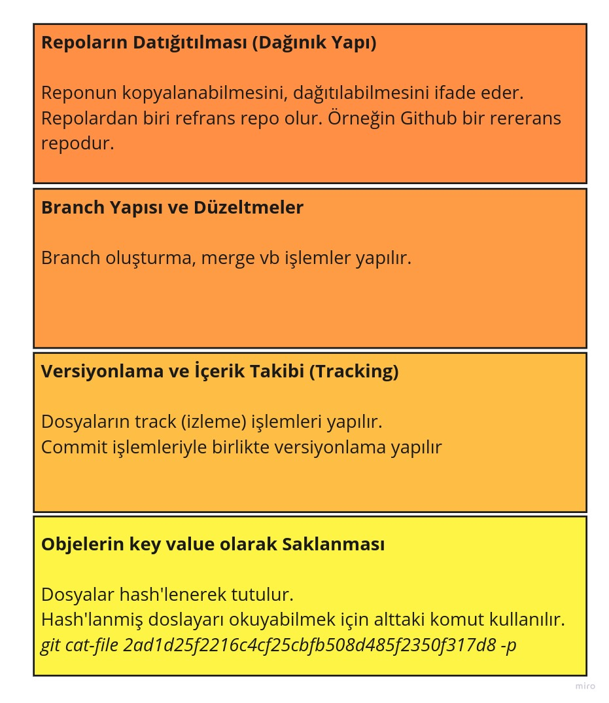
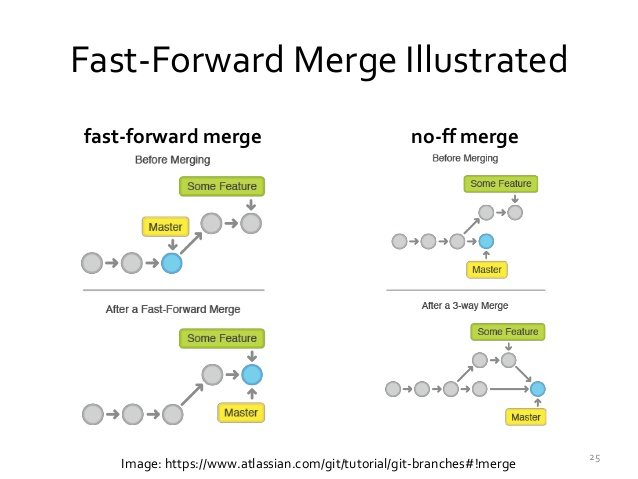
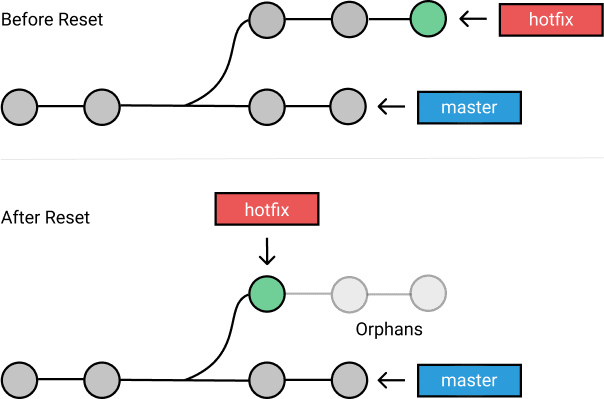
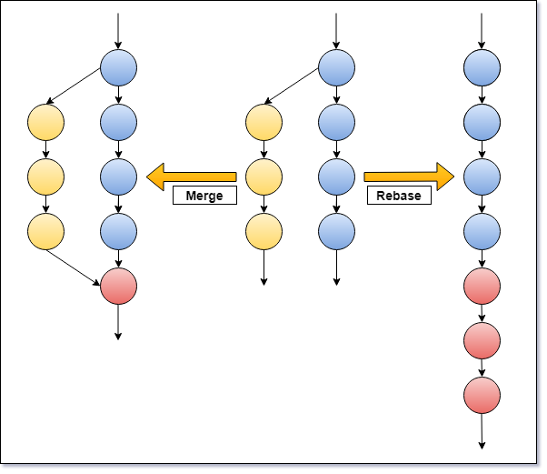
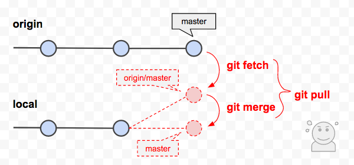

# Derinlemesine Git 1

Merhaba bu makalemizde Git'in dosyaları nasıl organize edip yönettiğini incelemeye çalışacağız.

Temelde Git dört temel işlevi yerine getirir.

1. Repoların Datığıtılması (Dağınık Yapı)
2. Branch Yapısı ve Düzeltmeler
3. Versiyonlama ve İçerik Takibi (Tracking) 
4. Objelerin key value olarak saklanması.




İçten dışa  doğru incelemeye başlayalım.

#### Objelerin Key-Value Olarak Saklanması

**Key Value Store**

Bütün dosyaların hash'i tutulur (sha1) ve değişiklikler bunun üzerinde track (izlenir) edilir. klasörlerin hatta commitlerin bile hash'i vardır.

Örneğin altaki kod ile bir string inputu hash'i alınır

```shell
echo "merhaba dünya" | git hash-object --stdin

# 2ad1d25f2216c4cf25cbfb508d485f2350f317d8
```

Bu string ifadede en ufak bir değişiklik yapacak olursak hash değişir. Buda dosyanın değiştiği anlamına gelir.

```
echo "merhaba dünya " | git hash-object --stdin
dd38a8c3d16d052a1b43ad961727d6a0d200d7c5
```

**Persistancy**

Klasörümüzü git init ile git reposu oluşturduktan sonra alttaki kodu çalıştırıp .git klasörüne bakacak olursak object klasörü altında bazı dosya ve klasörlerin olduğunu görebiliriz.

w parametresi ile diske yaz demiş oluyoruz.

```shell
echo "merhaba dünya" | git hash-object --stdin -w

#2ad1d25f2216c4cf25cbfb508d485f2350f317d8
```

Info ve pack klasörlerini yok sayıp diğerlerine bakacak olursak  bir adet (bende 2a adında) klasör olduğunu görebiliriz. Klasör içinde adı hash'imizle aynı olan bir dosya görülmektedir.

Bu dosyada bizim merhaba dünya diye yazdığımız metnin sıkıştırılmış binary blob hali bulunmaktadır. Git de bu dosyayı okumak için de komutlar bulunmaktadır.

-t parametresi type demektir ve dosyanın tipini dönmektedir.

```shell
git cat-file 2ad1d25f2216c4cf25cbfb508d485f2350f317d8 -t
blob
```

-p print anlamına geliyor.

```shell
git cat-file 2ad1d25f2216c4cf25cbfb508d485f2350f317d8 -p
merhaba dünya
```

#### Versiyonlama ve İçerik Takibi (Tracking)

Bunun için bir klasör içinde birkaç dosya ile birde ana dizinde readme adında bir dosya oluşturuyoruz.

```
liste.txt
dosyalar/dosya1.txt
dosyalar/dosya2.txt
```

Bu noktada eğer bir önceki git repo'nuzu kullandıysanız .git klasörü altındaki object klasöründe sadece önceki dosyamızın blob dosyasını görebiliriz. Eğer yeni bir git reposu oluşturduysanız info ve pack klasörleri dışında dosya görünmeyecektir.

Eğer git status ile dosyalarımızın durumuna bakacak olursak dosyaların untrack durumunda olduğunu görebiliriz. Yani git bu dosyalar hakkında henüz bir şey bilmiyor yani track etmiyor bu dosyaları.

```shell
git status
On branch master

No commits yet

Untracked files:
  (use "git add <file>..." to include in what will be committed)
        dosyalar/
        liste.txt

```

_git commit_ komutunu çalıştıracak olursak dosyaları staging area'ya almış oluruz. 

Dosyaları öncelikle add yapıyoruz. Bu işlemden sonra _git status_ komutunu çalıştıracak olursak alttaki gibi bir sonuç alacağız.

```shell
git status

# On branch master

# No commits yet

# Changes to be committed:
#   (use "git rm --cached <file>..." to unstage)
#         new file:   dosyalar/dosya1.txt
#         new file:   dosyalar/dosya2.txt
#         new file:   liste.txt

```


Dosylarımızı commit'leyip _git log_ komutu ile bakacak olursak dosylarımızın commit logunu görebiliriz.

```
git log
#commit f56470d56df19e45bade938ff2d3a97276c35be6 (HEAD -> master)
#Author: Murat Çabuk <muratcabuk@mail.com>
#Date:   Thu Apr 22 21:33:02 2021 +0300

#    first commit
```

Tekrar .git klasörü altındaki objects klasörüne bakacak olursak birçok klasör görebiliriz. log aldığımızda commit karşısında yeralan hash kodunun ilk iki digit'i objects klasöründeki klasörlerin isimlerine denk gelir. 

Artık bu hash dosyalarının içeriğinin nasıl okunacağını biliyoruz. Fakat komutu yazdığımızda alttaki gibi bir sonuçla karşılaşıyoruz.

```shell
git cat-file f56470d56df19e45bade938ff2d3a97276c35be6 -p

#tree c7dcd38517a7e45cedf1da70e4edd47a2bcc748b
#author Murat Çabuk <muratcabuk@mail.com> 1619116382 +0300
#committer Murat Çabuk <muratcabuk@mail.com> 1619116382 +0300

#first commit

```
Burası aslında ilgili verinin metadatasını tutar. Asıl context veri tabanındadır. Bunun için dikkat edilirse tree diye ayrı bir hash bulunmaktadır. Bu hash'in de ilk iki digit'i objects klasörü altında başka bir klasöre map etmektedir.

bu hash'i de okuyacak olursak alttaki gibi bir sonuç alacağız.

```shell
git cat-file c7dcd38517a7e45cedf1da70e4edd47a2bcc748b -p

#040000 tree cbca9028b3a2f44955d5b4e5bb31bf799a85a701    dosyalar
#100644 blob 40e987f47262db5476ff85dfc872e8294afaa5af    liste.txt
```

Yani görüleceği üzere herbir klasör için ayrı bir tree hash'i yer almaktadır.


Burada şuna dikkat etmek grekiyor. Eğer dosyalardan herhangi biri sistemde içerik olarak daha önce varsa onun için yeni bir dosya ve hash oluşturulmaz sistemdeki o dosyanın hash'i kullanılır. Yani bizim örneğimizde dosyalar klasörü içindeki dosya1.txt ve dosya2.txt içinde aynı metinler yazıyor olsaydı bu iki dosyanın içeriğini _git cat-file_ komutu ile okusaydık aynı hash'i görecektik iki dosya için. Yani bloblar doğrudan dosya değildir dosysnın içeriğidir ve git dosyaların veya klasörlerin bizzat kendisini tutmaz. Metadalar vasıtasıyla ilgili blobların hash'ini (dolayısıyla kasör yapısını da) tutmuş olur.

Her bir commit aslında bir hash dir ve her commit ilgili blobların hash bilgisini ve diğer metadataları tutar. Böylece birebir buraki kodları bir başkası uygulaycak olsa content hash'lari aynı olacak ama commit hash'larimiz farklı olacaktır çünki metadatlar farklı olacaktır (author, date vs).

**Versioning**

Burayı anlamak için öncelikle liste.txt dosyamızın içeriğini değiştiriyoruz ve commit'ledikten sonra log'a bakıyoruz.

```shell
git log

# commit 562e2899f2b66c9b8c5a4eae3328de73e975be93 (HEAD -> master)
# Author: Murat Çabuk <muratcabuk@mail.com>
# Date:   Thu Apr 22 22:01:18 2021 +0300

#     second comit

# commit f56470d56df19e45bade938ff2d3a97276c35be6
# Author: Murat Çabuk <muratcabuk@mail.com>
# Date:   Thu Apr 22 21:33:02 2021 +0300

#     first commit

```

Şimdi second commit in içeriğine bakalım.

```shell
git cat-file 562e2899f2b66c9b8c5a4eae3328de73e975be93 -p

# tree 150fe9fe5a342b53147a54aba2dd38afddd77246
# parent f56470d56df19e45bade938ff2d3a97276c35be6
# author Murat Çabuk <muratcabuk@mail.com> 1619118078 +0300
# committer Murat Çabuk <muratcabuk@mail.com> 1619118078 +0300

# second commit

```
Burada dikkat edersek parent diye öncekilerden farklı bir metadata bilgisi var. Bu parent üstte de görüleceği üzere ilk commit in hash'i aslında.

Ancak burada farklı bir tree oluşturulmuş. Çünkü aynı dosya yapısında değişen bir dosya var. Bu tree hash'i okuyacak olursak sadece değiştirdiğimiz liste.txt nin içerik blob hash'inin değiştiğini ancak dosyalar klasörünün tree hash'inin öncekiyle aynı olduğunu görürüz. Çünkü dosyalar klasörü içeriğinde bir değişiklik olmamıştır bu nedenle önceki blob'ların hash'leri (map) aynen kullanılmıştır.


```shell
git cat-file 150fe9fe5a342b53147a54aba2dd38afddd77246 -p
040000 tree cbca9028b3a2f44955d5b4e5bb31bf799a85a701    dosyalar
100644 blob ec30232b025202745d4c1497d93033a003a600ac    liste.txt
```

Tabii aklımıza şu soru gelebilir. Koca bir dosyada sadece bir satırı değiştirdik diye yeni blob oluşturulması dosya boyutlarını büyütmez mi? Aslında git blob oluştururken ciddi sıkıştırma yapar ayrıca blob'ları oluştururken sadece farkları yeni blob'a yazar böylece yerden tasarruf etmiş olur. 

Eğer commit'e tag (annotated tag denir aslında) eklersek bu tag bilgisi de doğrudan commit hash'i içine metadata bilgisi olarak yazılır.

Tekar edecek olursak objects klasörü altında  dört tip obje bulunur

1. Blobs
2. Trees
3. Commit
4. Annotated tags


Buraya kadar en alttaki key value map ile bir üstteki katman olan tracker katmanını görmüş olduk.

- https://git-scm.com/book/en/v2/Git-Internals-Git-Objects


#### Branch Yapısı ve Düzeltmeler

**Branches**

Şuan sistemimizde sadece tek bir brach var o da master.

```shell
git brach

#*master

```
Branch bilgileri .git altındaaki refs klasörü altındaki heads klasörü altında yer alır. Bu dosyanın içeriğine bakacak olursak yine bir hash görürüz.

```shell
cat .git/refs/heads/master 

# 562e2899f2b66c9b8c5a4eae3328de73e975be93
```
Bu hash aslında second commit'imize ait sha-1 hash'idir.

Master dan yeni bir branch create etiğimizde master içindeki aynı hash'i barındıran bir dosyanın _.git/refs/heads/branchname_ klasöründe oluştuğunu göreceğiz.


Yeni brach'de bir değişiklik yapıp git e commitlersek aşağıdaki gibi görüntü ortaya çıkacaktır.


 
Aktif olarak hangi branch üzerinde çalıştığımızı ise HEAD dosyası belirler. HEAD dosyasında branch path'i yazar. Branch dosyası içinde ise hangi commit üzerinde olduğumuzu gösteren hash verisi bulunur.


Merge yaptığımız durumda da aslında yeni bir blob açılır commit için. Bu blob read yapıldığında ise bir tree'ye işaret eden hash görülür. Bu commit in metadata verisinde ise aynı anda iki parent  olduğu görülür, çünkü iki commit merge yapılmıştır.



Merge işlemi master üzerinde iken yapıldıysa HEAD master branch'ini, master branch'i de son commmiti gösterir. Diğer branch'in HEAD'i ise eski yerindedir yani merge commit'i üzerinde değildir. 

Diğer branch'i de yeni oluşturulan commit üzerine getirmek için diğer branch üzerinde iken master branch'i ile merge yapıldığında yeni bir blob ve tree oluşturulmaz. Çünkü eski veriler zaten conflict'ler de çözülerek yeni commit'e aktarılmıştır. Commit işlemi çalıştırıldığında ekranda Fast-Forward yapıldığına dair bir mesaj görülür. Nedeni is diğer branch'in HEAD'i direk olarak son commit'e kaydırılmasıdır.  

**Orphaned Commit**

Eğer bir şekilde HEAD'in ilerisinde commit'ler kalırsa bunlara da orphaned("yetim/kimsesiz") commit denir. Bazen headless kavramının da kullanıldığını görebilirsiniz. B commit'ler bir zaman sonra git in garbage collector'u ile silinir.



**Rebasing**

Klasik merge işleminde bir commit girilir, iki branch bu commit üzerinde birleştirilerek iki adet parent eklenir. 

Rebase de ise diğer branch ile master branch'in ilk ayrıdıkları yerden itibaren diğer branch'in her bir commit'i olduğu gibi kopyalanarak master branch'ine yeni commit olarak eklenir. Son olarak ilk birleşim yerinden itibaren diğer branch silinir. 



#### Repoların Dağıtılması (Dağınık Yapı)

Distribution şunu ifade etmektedir. Örneğin biz GitHub'dan kodu kopyaladık, bizim gibi başkaları da aynı kodu kopyaladı diyelim. aynı anda bir çok developer'da kod ve bu koda dayalı git reposu var demektir. 

Bu durumda bir yerin referenace repo olması lazım. Bu durumda bu yer GitHub olacaktır.

Biz clone'lamayı yaptığımızda .git/config doyasına bazı satırlar ekli gelir. Örneğin bu dökümanın local'deki config dosyasına bakacak olursak remote reference olarak reponun adresini de görebiliriz.

ayrıca local'de tek bir branch olduğunu ve onunda origin adlı remote branch ile map'landiğini görebiliriz.

```config
[core]
	repositoryformatversion = 0
	filemode = true
	bare = false
	logallrefupdates = true
[remote "origin"]
	url = https://github.com/muratcabuk/derinlemesine-git
	fetch = +refs/heads/*:refs/remotes/origin/*
[branch "master"]
	remote = origin
	merge = refs/heads/master

```

local ve remote bütün branch'lerini listelemek için alttaki komut kullanılır.
```
git branch --all

<!-- * master
  remotes/origin/master -->
```

Remote branch bilgileri de refs klasörü altındaki remotes klasöründe yer alır.


Refs (refenrences) klasörü altındaki dosyaların içeriğni görmek için alltaki komutu çalıştırırız. Görülceği üzere remote ve local master branch'lar aynı commit üzerindedir.

```shell
git show-ref master

# 49cb5e959fea43d37b8c2dbdb9bdedc29b3848a4 refs/heads/master
# 49cb5e959fea43d37b8c2dbdb9bdedc29b3848a4 refs/remotes/origin/master

```

**Push**

Biz local brach'imizde eklemeler, silmeler ve değiştirmeler yaptıktan sonra push komutunu çalıştırdığımızda git sadece yeni eklenen commit'leri ve ilişkili tree, ve diğer object'leri gönderir. Sebebi ise object'lerin immutable olmasıdır ve dolayısıyla biz aslında ne yaparsak yapalım hep yeni objenin eklenmesidir. Yani silme işleminde dahi yeni bir commit ve onunla ilişkili tree ve blob'lar oluşur. 

**Local Remote Conflict, Pull and Fetch**

Diyelimki local master branch'imizde birşeyler yaptık fakat aynı anda remote branch de de bazı kodlar yazıldı. Bu durumda biz kodumuzu remote'a push yapmak istediğimizde conflict meydana gelecektir. Bu durumu düzeltmenin iki yolu var.

**1.** Kodumuzu push ederken -f flag ini kullanarak, remote'da biz aldıktan sonra yapılan değişiklikleri orphaned hale getirip local'de yaptığımız değişikleri remote dan aldığımız commit'e bağlayabiliriz. Ancak bu durumda git garbage collector headless kalan bu bölümü silecektir.


**2.** ilgili conflict'i local de çözümleyip öyle push edebiliriz.

Bu noktada pull ile fetch arasındaki farkı anlamamız gerekiyor. Pull komutu remote branch'deki değişiklikleri aldıktan sonra bir de merge yapar. Fetch ise sadece remote'daki değişiklikleri alır ancak merge yapmaz.



local de conflict ler çözümlenip local de merge işlermi tamamlandıktan sonra tekrar push yapılabilir.

Bu nedenle local'de yapılan rebase'leri remote'a göndermemek gerekir. Çünkü bu tarz bir merge işlemi conflict'lere sebep olacaktır.

Aşağıda görüleceği üzere rebase bütün adımları commit olarak ekler. bu durumdan habersiz olan diğer developer'ların push işlemi yaptıklarında conflict ile karşılaşmaları muhtemel bir durum olacaktır. Bu durumda burada yapılanları anlamak ve conflict'leri çözmek durumunda kalacaklardır.


#### Kaynaklar

- https://medium.com/@gokhansengun/git-nas%C4%B1l-%C3%A7al%C4%B1%C5%9F%C4%B1r-bf405779116b
- https://git-scm.com/book/en/v2/Distributed-Git-Distributed-Workflows
- https://git-scm.com/docs/git-push
- https://git-scm.com/book/tr/v2/Git-Internals-Git-Objects
- https://git-scm.com/book/en/v2/Git-Branching-Branches-in-a-Nutshell
- https://www.atlassian.com/git/tutorials/using-branches
