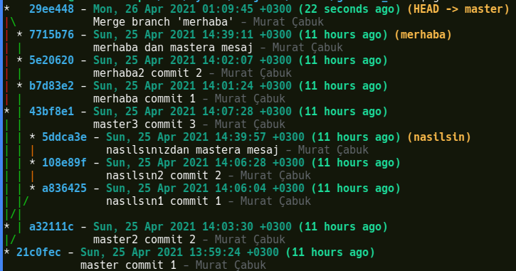

# Derinlemesine Git 2

Merhaba,

Bu makalemizde commit'lerimizi birleştirken kullandığımız _git merge_ komutunun merge işlemini yaparken git history'inde yapacağı değişikliği yönetmek için kullanılan opsiyonları inceleyeceğiz.

- No Fast-forward
- Fast-forward
- Fast-forward Only

Ayrıca history'yi değiştiren _git _rebase_ ve _git cherry-pick_ komutlarını da _git merge_ komutu ile olan ilişkisini ve farklarını inceleyerek anlamaya çalışacağız.

Genellikle bu konular kaynaklarda "merge strategies" başlığıyla verilir ancak bu yanlış bir tanımlamadır. [Resmi git dokümanlarına](https://git-scm.com/docs/git-merge) da bakacak olursanız strategies kelimesinin conflict'ler çözülürken kullanılan teknikleri ifade ettiğini görebilirsiniz. Bu teknikleri de merge işlemlerinde opsiyon olarak kullanmak mümkündür.

Merge Stratejilerinin kullanımı ile ilgili [Atlassian Bitbucket sayfasında](https://www.atlassian.com/git/tutorials/using-branches/merge-strategy) güzel bir makale mevcut.

İyi okumalar

#### No Fast-forward Merge

Master branch üzerinde feature branch'i oluşturulduktan sonra iki commit olsun. Feature üzerinde aynı şekilde iki adet commit olsun. T anında master üzerinde iken _git merge feature_ komutu çalıştırıldığında __yeni bir commit oluşur__ ve bu commit metadatasında __iki adet parent__ oluşur. Bir tanesi master diğer ise feature branch'ini gösterir.

Kontrol etmek için alttaki komut kullanılabilir.

```shell
git cat-file -p COMMIT_ID
```

İekilde de görüleceği üzere master branch'i iki parent'a ayrılır (diverged).


_git log_ komutu ile check ettiğimizde açıklamlarda _Merge: 7222f6a c952e91_  şeklinde iki parent görülebilir.


#### Fast-forward merge 

_git merge_ komutu çalıştırıldığında default olan budur yani --ff otomatik olarak çalıştırlır. bu merge tipinde dallanma, ayrılma (diverged) oluşmaz. __yeni commit oluşmaz__ bunun yerine master branch in HEAD'i en feature branch üzerindeki son commite taşınır. Tek __bir parent__ oluşur/vardır.

üstteki şekilde sağdaki fastf-forward merge i gösterir.


rebase den farklı olarak yeni commitler oluşmaz halihazırda var olan commitler olduğu gibi kullanılır. rebase de ise feature branch indeki commitler copyalnarak yeni commitler oluşturulur ve eskileride silinir.


**Örnek Uygulama**

Öncelikle alttaki görüntüyü almak için alttaki komutu çalıştırmalısınız. Burada t3 adında bir alias tanımlamış oluyoruz.

```shell
git config --global alias.t3  "log --graph --abbrev-commit --decorate --format=format:'%C(bold blue)%h%C(reset) - %C(bold cyan)%aD%C(reset) %C(bold green)(%ar)%C(reset)%C(bold yellow)%d%C(reset)%n''          %C(white)%s%C(reset) %C(dim white)- %an%C(reset)' --all"

git t3
```


"Merhaba" branch'i master ın ilk commit'inden sonra ayrılmış. Dikkat edilirse master branch'inin ikinci commit'inden sonra da "nasilsin" branch'i ayrılmış. Grafik yanlış anlaşılmasın. a32122c id'li commit'in merhaba branch'i ile ilgisi yok. a32122c id'li commit master branch'in ikinci commit'i ve bu koldan "nasilsin" branch'i ayrılmış.

HEAD ise master branch üzerinde 43bf8e1 commit'i üzerinde.

Üstteki gibi bir yapı kurduktan sonra merge işlemlerimizi yapalım.

```shell
git checkout master
git merge merhaba --ff
```


Ancak sonuç beklediğimiz gibi olmadı. Çünkü -ff komutu öncelikle --ff-only parametresi ile fast forward commit yapılıp yapılamayacağını test eder eğer yapılamayacaksa yeni bir commit oluşturarak problemleri (conflict) çözer veya çözdürür. Peki bizim bu ortamımızda neden --ff-only çalışmadı? çünkü master branch'inde merhaba branch i oluşturulduktan sonra değişiklikler oldu. --ff-only nin çalışabilmesi için master branch'deki history'nin "merhaba" branch'inde olması gerekirdi.

Böyle bir durumu test etmek için commit history'de geri gidelim.

```shell
git reflog
```


HEAD@{18} mantıklı görünüyor. "Merhaba" branch'i işini bitirmiş ve master branch i değişikliğe geçmeden önceki durum.

```shell
git reset --hard HEAD@{18}
```


Dikkat edilirse HEAD, master üzerinde commit 1 üzerinde.


Daha sonra --ff-only parametresi ile merge işlemini gerçekleştiriyoruz.

```shell
git merge merhaba --ff-only
# Updating 21c0fec..7715b76
# Fast-forward
#  master1.txt  | 3 ++-
#  merhaba1.txt | 1 +
#  merhaba2.txt | 1 +
#  3 files changed, 4 insertions(+), 1 deletion(-)
#  create mode 100644 merhaba1.txt
#  create mode 100644 merhaba2.txt

```
Komutun hemen altında "Updating 21c0fec..7715b76" geçen bir satır var. bu satır aslında HEAD'in nereden nereye hareket ettiğini gösteriyor. Harekete göre HEAD merhaba branch'i üzerindeki son commit üzerinde. Böylece yeni bir commit oluşturmadan sadece HEAD'i hareket ettirerek commit yapmış olduk. 


Peki bu durumda branch'imizi kontrol edecek olursak halen master üzerinde olduğumuzu görebiliriz.

```shell
git branch
# * master
#   merhaba
#   nasilsin
```

Bu noktada acaba "nasilsin" branch'i ile birleşebilir miyiz diye düşünelim. Tree ye dikkat edersek master'ın şuan bulunduğu yer itibariyle "nasilsin" branch'i ayrıldıktan sonra master branch'ine "merhaba" branch'i' ile birleşiminden sonra başka commitlerin eklendiği görünüyor. Bu durumda bunu yapamayız.

```shell
git merge nasilsin --ff-only
# fatal: Not possible to fast-forward, aborting.
```
Ancak --ff komutu ile yapacak olursak bu mümkün ocaktır. Çünkü arka tarafta --no-ff çalışacaktır ve bir commit create edilerek problemler çözülecektir yada otomatik çözülemeyenler için bize conflict'leri manule çözebilmememiz için imkan verilecektir.

```shell
git merge nasilsin --ff
# Merge made by the 'recursive' strategy.
#  master2.txt   | 2 ++
#  nasilsin1.txt | 1 +
#  nasilsin2.txt | 1 +
#  3 files changed, 4 insertions(+)
#  create mode 100644 master2.txt
#  create mode 100644 nasilsin1.txt
#  create mode 100644 nasilsin2.txt
```


#### Squash Merge

Burada ise __yeni bir commit oluşur__. Aşağıdaki şekilde en sağdaki squash merge'e bakacak olursak feature branch'inde oluşturulan C4 ve C5 commit'leri tekbir commit'te birleşerek develop branch'indeki C3'e bağlanmıştır. Bu commit tipinde yeni oluşan branch'de __tek bir parent__ vardır ancak commit mesajında feature branch'indeki iki commiti'nde mesajları birlikte tutulur.


Yani "no ff" opsiyonundan farklı olarak 2 adet parent yoktur.

**örnek uygulama**

Alttaki görüntüyü almak için öncelikle alttaki komutu çalıştırarak t3 alias'ı oluşturmalısınız daha önce oluşturduysanız çalıştırmanıza gerek yok.

```shell
git config --global alias.t3  "log --graph --abbrev-commit --decorate --format=format:'%C(bold blue)%h%C(reset) - %C(bold cyan)%aD%C(reset) %C(bold green)(%ar)%C(reset)%C(bold yellow)%d%C(reset)%n''          %C(white)%s%C(reset) %C(dim white)- %an%C(reset)' --all"

git t3
```


"Merhaba" branch'i master branch'inin ilk commit'inden sonra ayrılmış. Dikkat edilirse master branch'in ikinci commit'inden sonra da "nasilsin branchi ayrılmış. Grafifk yanlış anlaşılmasın a32122c id li commit'in merhaba branch'i ile ilgisi yok. a32122c id'li commit master branch'in ikinci commit'i ve bu koldan "nasilsin" branch'i ayrılmış.

"Merhaba" branch'i üzerindeki tüm commit'leri tek bir commit create ederek master branch'i üzerine commit'lemek için alttaki komutu çalıştırıyoruz.

```shell
git checkout master
git merge merhaba --squash
git commit # burayı çalıştırmak zorundayız atlamayınız
```


Görüldüğü üzere "merhaba" branch'inde yer alan 2 yeni branch master sonuna eb1026d id'li bir commit create edilerek merge işlemi tamamlandı.

#### Cherry-Pick

Başka bir branch'deki bir commit'i diğer bir branch a __kopyalayarak__ commit'lemektir.

Yani diğer branch'de commitler halen durmaktadır.


Feature branch'inden kopyalanan commit feature branch'inden silinmez.

__Tek bir parent oluşur yeni commitlerde__  ancak aynı koddan iki adet oluşmaktadır ve commit id'leri farklı olmaktadır. git history çizgisini bozmaktadır.


**Örnek Uygulama**

Alttaki görüntüyü almak için yukarıda tekrarladığım alias oluştrma komutunu çalıştırmalısınınız.

```shell
git t3
```


"Merhaba" branch'i üzerinde ki 5e20620 id'li commit'i master baranch üzerine kopyalayalım. 

```shell
git checkout master

git cherry-pick 5e20620
# CONFLICT (modify/delete): merhaba1.txt deleted in HEAD and modified in 5e20620... merhaba2 commit 2. Version 5e20620... merhaba2 commit 2 of merhaba1.txt left in tree.
# error: could not apply 5e20620... merhaba2 commit 2
# hint: after resolving the conflicts, mark the corrected paths
# hint: with 'git add <paths>' or 'git rm <paths>'
# hint: and commit the result with 'git commit'

```

Bu hareket ile aslında 5e20620 id'li commit'i master branch'e kopyalarken parent'ından koparmış oluyoruz. Bir önceki adımda ise merhaba1.txt adında bir dosya create edilmişti ancak bu bağ yeni birleşme ile yok olduğu için bu dosyanın silinmesi ve kopyalamaya çalıştığımız 5e20620 id'li commit'te de merhaba2.txt adında bir dosya create edilediği için index(stage)'e eklenmesi gerekiyor. Tam bu sırada _git status_ komutunu çalıştırırsak aynı şeyi göreceğiz.

```shell
git status
# On branch master
# You are currently cherry-picking commit 5e20620.
#   (fix conflicts and run "git cherry-pick --continue")
#   (use "git cherry-pick --skip" to skip this patch)
#   (use "git cherry-pick --abort" to cancel the cherry-pick operation)

# Changes to be committed:
#         new file:   merhaba2.txt

# Unmerged paths:
#   (use "git add/rm <file>..." as appropriate to mark resolution)
#         deleted by us:   merhaba1.txt

```
Dosyarları track edip commit'liyoruz.

```shell
git add .
git commit

git t3
```


#### Merge Yerine Rebase


Rebase'i __görüntü olarak fast-forward a benzetebiliriz__. Ancak yapısı ve oluşma şekli ondan çok farklıdır. 

Şöyle düşünebiliriz cherry-pick ile tek tek kopyalama yaparak feature branch'den master branch'a kopyalama yapıp daha sonra kopyaladığımız feature branch'i sildiğimizi düşünelim. Bu tam olarak rebase'i açıklar. Tabii ki rebase bunu tek hareketle yapmış olur.


**Örnek Çalışma**

```shell
git t3
```


Şimdi master branch'ini merhaba üzerine rebase yapalım. normalde böyle bir şey yapmak mantıksız. Amacımız hem rebase komutunun mantığını anlamak hem de hata durumunda rebase'i geri almak.

```
git checkout master

git rebase merhaba
```


Görüldüğü üzere komut  master branch'inde rebase den önce yer alan a32111c ve 43bf8e1 commit'lerini "merhaba" branch'i üzerine kopyaladı. Eski commitler artık yok yeni commit id'leri de aşağıdaki gibi. 

a32111c --> 1ca197
43bf8e1 --> f72416d

Dikkat edilirse master branch'in ilk commit'i taşınmadı sebebi ise merhaba branch, master branch'in ilk commit'inden sonra oluşturuldu. Yani ayırım commit 1'den sonra başladı. commit 2'den sonra başlasaydı commit 2'den sonra kopyalama yapılacaktı. 

Aslında yapmak istediğimiz merhaba branch ini master üzerine getirmekti. Bu durumda rebase'i geri almak için reflog'lara bakmamız gerekiyor. 

```shell
git reflog
```


Listede branch ler üzerinde yaptığımız hareketleri görebiliriz. Dikkat edilirse rebase işleminden önce  en son HEAD@{8} da "nasilsin" branch'i üzerinde "nasılsınızdan master a mesaj" diye bir commit atmışız ve HEAD@{7}'de de master branch'ine geçiş yapmışız. Bu durumda HEAD@{7}'ye yani 43bf8e1 id'li commit id'ye dönmemiz yeterli olacaktır. 

```shell
git reset --hard 43bf8e1 # yada HEAD@{7}
```
Yeni duruma bakacak olursak rebase den önceki halimize geri dönmüş olduğumuzu görebiliriz.


Şimdi doğru kodu çalıştıralım.

```shell
git checkout merhaba

git rebase master
```


Artık merhaba branch'i üzerindeki commit'ler master branch'i üzerine kopyalanmış.

Rebase komutu şu şekilde de çalıştırılabilirdi.

```shell
git rebase master merhaba

# biz diğer version olan merhaba branch'i üzerindeyken alttaki komutu çalıştırmıştık

#git rebase master
```

Peki bunun mantığı nedir? sanki komut tersinden çalışıyormuş gibi görünüyor ama değil. Aslında hangi branch üzerinde işlem yapıyorsak onun üzerinde olmamız gerekiyor. Örneğin merge _git merge_ komutunda da diyelim ki master branch'i merhaba branch'ine merge yapacağız bu durumda master branch'i checkout yaptıktan sonra _git merge master -ff_ şeklinde çalıştırıyoruz komutu.


Umarım faydalı bir yazı olmuştur. Diğer  derinlemesine git makalemizde görüşmek üzere.