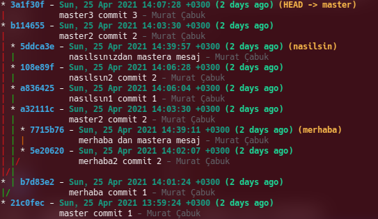
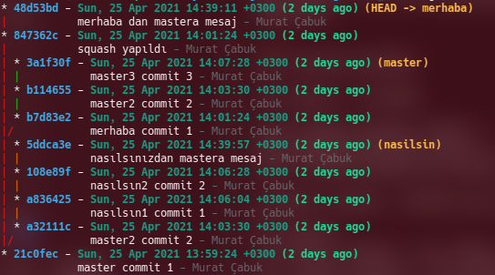
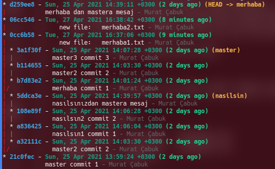
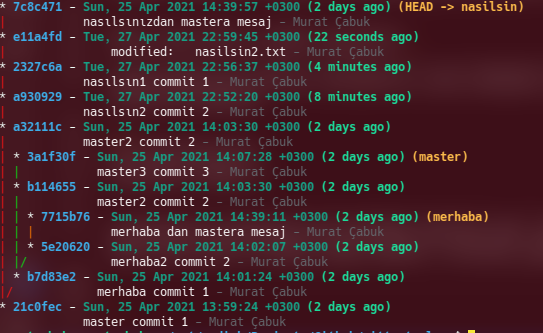
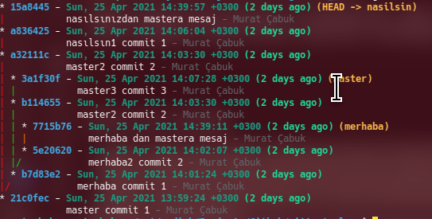

# İneraktif Rebase ile Git Geçmişini Yeniden Yazmak


Merhaba arkadaşlar,

Derinlemesine Git serimizin bu üçüncü makalesinde "interactive rebase" konusunu öğrenmeye, anlamaya çalışacağız.

Başlıktan da anlaşılacağı üzere iner rebase git history'imizi değiştirmeye/yeniden yazmaya yarıyor. 

Ancak şu uyarıyı dikkate almamız gerekiyor.Shared commit'ler üzerinde asla rebase yapmayınız. remote repolarda özellikle geçmişte yapılacak değişiklikler çok yorucu olabilir. 

Ancak yine örneğin paylaşılmaması gereken bir bilgi history'ye yazıldıysa silinmesi gerekebilir. Bunun için de aslında en iyi yöntem BFG aracı ile tüm history den belli bir dosya veya metni silmektir. detaylar için şu linki [inceleyebilirsiniz](https://docs.github.com/en/github/authenticating-to-github/removing-sensitive-data-from-a-repository).

**_git blame_ komutu bir dosyada yapılmış tüm değişimleri ve commit bilgilerini verir.**

```
git blame DOSYA_ADI
```

**Önemli Not:  interactive rebase de base olarak seçilen commit rebase işlemine dahil edilmez.** Yani verilen commit den sonraki ilk commit base olarak kullanılır. Peki root commit'in bizzat kendisinde işlem yapmamız gerekseydi? Bunun için  komuta --root parametresini eklememiz gerekiyor.

Normal rebase aslında sadece bir branch'in başka bir branch'in HEAD'ine bağlanmasını sağlar. Ancak interactive rebase çok daha fazlasını yapar. Bütün commit'lerin history'sinde değişiklik yapabilir. Bu bağlamda interactive rebase normal rebase'i de kapsamaktadır.

Örneklerimiz için alttaki projeyi kullanıyor olacağız.



Alttaki komutu girdiğimizde bize bir çok seçenek sunulacak. Bütün seçenekleri incelemeye çalışacağız.


```bash
git rebase -i commitid
```


## Squash (İki veya daha fazla commit'i birleştirmek)

Amacı geçmişteki iki veya daha fazla commit'i birleştirmektir.


Diyelim ki merhaba branch'i üzerinde b7d83e2 commit'i ile ondan bir sonraki 5e20620 commit'ini birleştirmek isteyelim. Bunun için ilk commit'ten bir önceki commit'ten başlamamız gerekir. Örneğimize göre ilk commit aslında master branch'i üzerindeki 21c0fec commit'i. Ancak bu commit merhaba branch'inin de master ile bağlı olduğu commit. Bu nedenle öncelikle merhaba branch'ine geçiş yapıp daha sonra interactive rebase'i çalıştırmalıyız.

Eğer rebase'i root dan başlatmamız gerekseydi o zaman --root opsiyonunu eklememiz gerekirdi.

```bash
git checkout merhaba

git rebase -i 21c0fec

pick b7d83e2 merhaba commit 1
pick 5e20620 merhaba2 commit 2
pick 7715b76 merhaba dan mastera mesaj

# Rebase 21c0fec..7715b76 onto 21c0fec (3 commands)
#
# Commands:
# p, pick <commit> = use commit
# r, reword <commit> = use commit, but edit the commit message
# e, edit <commit> = use commit, but stop for amending
# s, squash <commit> = use commit, but meld into previous commit
# f, fixup <commit> = like "squash", but discard this commit's log message
# x, exec <command> = run command (the rest of the line) using shell
# b, break = stop here (continue rebase later with 'git rebase --continue')
# d, drop <commit> = remove commit
# l, label <label> = label current HEAD with a name
# t, reset <label> = reset HEAD to a label
# m, merge [-C <commit> | -c <commit>] <label> [# <oneline>]
# .       create a merge commit using the original merge commit's
# .       message (or the oneline, if no original merge commit was
# .       specified). Use -c <commit> to reword the commit message.
#
# These lines can be re-ordered; they are executed from top to bottom.
#
# If you remove a line here THAT COMMIT WILL BE LOST.
#
# However, if you remove everything, the rebase will be aborted.
#
# Note that empty commits are commented out
```

Seçeneklerden **squash** olan ile devam edeceğiz.

Bizim amacımız alttaki iki tanesini birleştirmek. Bu arada şuna dikkat etmemiz gerekiyor. En eski commit en üstte görünüyor olacak. Sebebi ise eskiden yeniye doğru gitmemiz gerekiyor. Çünkü eskide yaptıklarımız yeni olanları da etkileyecektir. Böyle bir durum belki kod bloğu silmemiz, eklememiz yada bir dosyayı olduğu gibi silmemiz vb durumlarda geçerli olabilir.

- **pick** : değişiklik istemiyorum olanı alabilirsin
- **reword**: commit mesajını değiştir
- **squash** : iki commit'i birleştir fakat birleştirmeyi bir önceki commit'e yapar
- **edit**: Rebase'i durdurur ve commit üzerinde değişiklik yapabilmenizi sağlar. İstediğiniz değişikliği yapıp rebase işlemine devam ederseniz (git rebase --continue) o commit'in içeriği değişecektir. Ayrıca eğer rebase yaptığınız commit birbiriyle veya commit mesajı ile alakasız değişiklikler içeriyorsa ve siz bu commit ile alakasız olan değişikliği farklı bir commit olarak kaydetmek istiyorsanız rebase'den çıkmadan commit'leri yapıp rebase işlemini sonlandırdığınızda değişikliklerin farklı commit'lere ayrıldığını göreceksiniz. (kaynak : https://mesuutt.com/2016/07/git-rebase-interactive/)
- **fixup**: squash gibi commit'i kendinden once yapılan commit ile birleştirir. Tek farkı commit mesajı olarak fixup olarak işaretlenen commit'ten once yapılan commit'in mesajını kullanır (kaynak : https://mesuutt.com/2016/07/git-rebase-interactive/).

Yani eğer alttaki 2 taneyi birleştirmek istiyorsak ikincisine squash yazmamız yeterli çünkü parent ı listede üstte olan commit yani b7d83e2.

```
pick b7d83e2 merhaba commit 1
pick 5e20620 merhaba2 commit 2
```
ekranda ikinci commiti editleyip dosyayı kaydediyoruz.

```
pick b7d83e2 merhaba commit 1
squash 5e20620 merhaba2 commit 2
pick 7715b76 merhaba dan mastera mesaj
```

Kaydetme işlemi tamamlanınca bize squash için gerekli commit mesajını düzenlememizi sağlıyor. Mesajı düzenleyip tekar kaydediyoruz.

Bu commit'lerden birincisinde merhaba1.txt diye bir dosyaya "merhaba commit 1" ve ikinci commit'te de merhaba2.txt diye bir dosyaya "merhaba commit 2" yazmıştık.

Ekrana gelen mesaj şu şekilde

```
[detached HEAD 847362c] squash yapıldı
 Date: Sun Apr 25 14:01:24 2021 +0300
 2 files changed, 2 insertions(+)
 create mode 100644 merhaba1.txt
 create mode 100644 merhaba2.txt
Successfully rebased and updated refs/heads/merhaba.
```
Tekrar tree yapımıza bacak olursak b7d83e2, 5e20620 commit'leri birleşerek 847362c commit'inde birleştiği görülür. Ancak bir fark daha var birleştirmeye dahil etmediğimiz merhabanın en son commit'i olan 7715b76 commit'i de squash yapılan commit'in üzerine 48d53bd commit'i olarak yeniden oluşturulmuş.



Bir önceki tree yapısı


## Split Commmit (commitleri parçalara ayırmak)

Tekrar en başa dönelim. 


Örneğimiz için diyelim ki tek bir commit'te iki dosyayı değiştirmiş olalım ve bunları iki ayrı commit'e bölmek isteyelim. Bunun için önce iki commit'i üstteki squash'daki gibi birleştirelim ve daha sonra ayıralım. 

Yine merhaba branch'i üzerindeki ilk iki commit'i birleştiriyoruz.


```bash
git checkout merhaba

git rebase -i 21c0fec

pick b7d83e2 merhaba commit 1
squash 5e20620 merhaba2 commit 2
pick 7715b76 merhaba dan mastera mesaj
```

Mesaja da "squash yapıldı" yazıyoruz ve önceki iki mesajı da koruyarak squash işlemini tamamlıyoruz.


attaki komutla birleşen commit'te neler olduğuna bi bakalım.

```bash
git show 3606250 --name-only 

#sonuç
commit 3606250c222cc5231569d3d6a35a0ed3bd30f924
Author: Murat Çabuk <muratcabuk@mail.com>
Date:   Sun Apr 25 14:01:24 2021 +0300

    squash yapıldı
    
    merhaba commit 1
    
    merhaba2 commit 2

merhaba1.txt
merhaba2.txt

```

Görüldüğü üzere iki adet dosyamız değişikliğe uğramış. Şimdi amacımız bunu eski haline geri getirmek. 

İkiye ayırmak istediğimiz commit'e edit yazıyoruz ve kaydediyoruz.

```bash
git rebase -i 21c0fec


edit 3606250 squash yapıldı
pick ec9c031 merhaba dan mastera mesaj
```

Dosyayı kaydettiğimize aşağıdaki gibi bir ekranla karşılaşırız.

```bash
Stopped at 3606250...  squash yapıldı
You can amend the commit now, with

  git commit --amend 

Once you are satisfied with your changes, run

  git rebase --continue

```
Bu esnada eğer status'a bakacak olursak aşağıdaki gibi bir ekran göreceğiz

```bash
git status

#sonuç
interactive rebase in progress; onto 21c0fec
Last command done (1 command done):
   edit 3606250 squash yapıldı
Next command to do (1 remaining command):
   pick ec9c031 merhaba dan mastera mesaj
  (use "git rebase --edit-todo" to view and edit)
You are currently editing a commit while rebasing branch 'merhaba' on '21c0fec'.
  (use "git commit --amend" to amend the current commit)
  (use "git rebase --continue" once you are satisfied with your changes)

nothing to commit, working tree clean

```
log u inceleyecek olursak HEAD in 3606250 commit'i (yani suqash için yeni açılan commit) üzerinde olduğunu görebiliriz. Ancak bizim split yapabilmek için bir önceki durumda olmamız gerekiyor.

```bash
git log --oneline

3606250 (HEAD) squash yapıldı
21c0fec master commit 1
```

Önceki commit'e gitmek için

```
git reset --mixed HEAD~
```
Daha sonra status a bakacak olursak. İki adet dosyamızın stage(index) alanında olmadığını yani track edilmediğini görebiliriz.

```bash
git status

#sonuç
interactive rebase in progress; onto 21c0fec
Last command done (1 command done):
   edit 3606250 squash yapıldı
Next command to do (1 remaining command):
   pick ec9c031 merhaba dan mastera mesaj
  (use "git rebase --edit-todo" to view and edit)
You are currently editing a commit while rebasing branch 'merhaba' on '21c0fec'.
  (use "git commit --amend" to amend the current commit)
  (use "git rebase --continue" once you are satisfied with your changes)

Untracked files:
  (use "git add <file>..." to include in what will be committed)
        merhaba1.txt
        merhaba2.txt

nothing added to commit but untracked files present (use "git add" to track)
```

Şimdi bu dosyaları sırasıyla add ve commit yapacağız.

```bash
git add merhaba1.txt 
git commit -m "new file:   merhaba1.txt"

git add merhaba2.txt 
git commit -m "new file:   merhaba2.txt"
```

Takrar status a bakacak olursak rebase akışının tamamlanmadığını görebiliriz. 

```bash
git status

#sonuç
interactive rebase in progress; onto 21c0fec
Last command done (1 command done):
   edit 3606250 squash yapıldı
Next command to do (1 remaining command):
   pick ec9c031 merhaba dan mastera mesaj
  (use "git rebase --edit-todo" to view and edit)
You are currently editing a commit while rebasing branch 'merhaba' on '21c0fec'.
  (use "git commit --amend" to amend the current commit)
  (use "git rebase --continue" once you are satisfied with your changes)

nothing to commit, working tree clean

```
Logları inceleyelim. İki adet commit olduğunu görebiliriz.

```bash
git log --oneline

06cc546 (HEAD)  new file:   merhaba2.txt
0cc6b58         new file:   merhaba1.txt
21c0fec master commit 1
```

Rebase işlemini devam ettirdiğimizde başka adım olmadığı için rebase tamamlanmış olacak.

```bash
git rebase --continue 
Successfully rebased and updated refs/heads/merhaba.
```

Tekrar tree'yi görebiliriz.




Merhaba branch'ine dikkat edilecek olursa 0cc6b58, 06cc546 id'li iki adet commit eklendiği görülebilir. Squash dan sonra bir adetti burası. Altta bir önceki halini de görebilirsiniz. 

Ancak burada ilginç bir duru var dikkat edilirse b7d83e2 id'li commit master branch'inden silinmemiş ki bu gayet mantıklı. Çünkü bu commit aynı zamanda master branch'in ikinci commit'i.

Altta bir önceki versiyonda da squash yaptığımızda bu commit'in saklandığını görebiliriz.


## Reordeing (commitlerin sırasını değiştirmek)

İlk baştaki tree yapımızı hatırlayalım.


nasilsin branch'i üzernde 108e89f ile 108e89f commit'lerinin yerini değiştirmek istiyoruz. 

```bash
git checkout nasilsin

# bir önceki commiti seçiyoruz
git rebase -i a32111c 

# ikisi yer değiştirildi

pick 108e89f nasılsın2 commit 2
pick a836425 nasılsın1 commit 1
pick 5ddca3e nasılsınızdan mastera mesaj

```
Kaydettiğimizde conflict olduğuna dair mesaj alıyoruz.

```bash
git rebase -i a32111c

#sonuç
CONFLICT (modify/delete): nasilsin1.txt deleted in HEAD and modified in 108e89f... nasılsın2 commit 2. Version 108e89f... nasılsın2 commit 2 of nasilsin1.txt left in tree.
error: could not apply 108e89f... nasılsın2 commit 2
Resolve all conflicts manually, mark them as resolved with
"git add/rm <conflicted_files>", then run "git rebase --continue".
You can instead skip this commit: run "git rebase --skip".
To abort and get back to the state before "git rebase", run "git rebase --abort".
Could not apply 108e89f... nasılsın2 commit 2
```
Bu nedenle önce conflict'i çözmemiz gerekiyor.

İlk olarak status a bir bakalım 

```bash
git status

#sonuç
interactive rebase in progress; onto a32111c
Last command done (1 command done):
   pick 108e89f nasılsın2 commit 2
Next commands to do (2 remaining commands):
   pick a836425 nasılsın1 commit 1
   pick 5ddca3e nasılsınızdan mastera mesaj
  (use "git rebase --edit-todo" to view and edit)
You are currently rebasing branch 'nasilsin' on 'a32111c'.
  (fix conflicts and then run "git rebase --continue")
  (use "git rebase --skip" to skip this patch)
  (use "git rebase --abort" to check out the original branch)

Changes to be committed:
  (use "git restore --staged <file>..." to unstage)
        new file:   nasilsin2.txt

Unmerged paths:
  (use "git restore --staged <file>..." to unstage)
  (use "git add/rm <file>..." as appropriate to mark resolution)
        deleted by us:   nasilsin1.txt

```

Yeni bir dosya eklendiğini (Changes to be committed bölümünde nasilsin2.txt) ve bir dosyanın da unmerged şekilde beklediğini gösteriyor (Unmerged paths: deleted by us:   nasilsin1.txt).

Unmerged durumunda böyle bir durumun olması aslında gayet normal. Çünkü ikinci commit'i birinci yerine alıyoruz dolayısıyla parent değişiyor ve bir önceki (şuan unmerged durumundaki silinecek nasilsin1.txt commit'inin olduğu) commit bu durumda yapılmamış olacak ve dolayısıyla dosya da olmuyor olacak. Ancak sistem bu silme işlemini onaylamamızı istediği için merge işlemini yapamıyor. Biz dosyayı add komutu ile stage(index) alanına ekler commit eder ve rebase continue dersek bir sonraki adıma geçebiliriz. Aslında bir sonraki adımda da bize bu dosyanın create edilmesi gerektiği ile ilgili bir conflict çözdürecek. Çünkü bu dosya yer değişiminden sonra create olmuş olacak.

İkinci conflict de şu şekilde

```bash
git status

#sonuç
interactive rebase in progress; onto a32111c
Last commands done (2 commands done):
   pick 108e89f nasılsın2 commit 2
   pick a836425 nasılsın1 commit 1
Next command to do (1 remaining command):
   pick 5ddca3e nasılsınızdan mastera mesaj
  (use "git rebase --edit-todo" to view and edit)
You are currently rebasing branch 'nasilsin' on 'a32111c'.
  (fix conflicts and then run "git rebase --continue")
  (use "git rebase --skip" to skip this patch)
  (use "git rebase --abort" to check out the original branch)

Unmerged paths:
  (use "git restore --staged <file>..." to unstage)
  (use "git add <file>..." to mark resolution)
        both added:      nasilsin1.txt
```

Dosyayı add yapmadan önce içeriğine bir bakalım

```bash
<<< <<<< HEAD
nasılsın2 commit 2
=======
nasılsın1 commit 1
>>>> >>> a836425... nasılsın1 commit 1
```

Görüldüğü üzere bu dosyaya her iki commit'inde satırları eklenmiş ancak bizim beklentimiz sadece "nasılsın1 commit 1" yazması çünkü nasilsin1.txt dosyasında bu yazıyordu daha önce.

add ve commit yapabiliriz.

Birde nasilsin2.txt dosyasının içine bir bakalım.

```bash
cat nasilsin2.txt

#sonuç
nasılsın1 commit 1
```

İsterseniz bu doayayı da ilk halindeki metinle yani "nasilsin2 commit 2" olarak değiştirelim daha sonra add ve commit yapıp rebase'i continue yapalım.



Dikkat edilirse "nasilsin2 commit 2" mesajlı commit ile  "nasilsin1 commit 1" yer değiştirmiş. Ancak fazladan birde e11a4fd id'li commit eklenmiş. O da bizim hatamız oldu aslında. ilk dosyaları yer değiştirirken içini kontrol etmediğimiz commit 2 nin içeriğini sonradan değiştirmiş olduk.

Önceki hali


## Dropping Commit (commit silmek)

ilk durumumuzu görelim


Diyerlim ki nasılsın branch'i üzerindeki 108e89f id'li commit'i silmek istiyoruz.

Bir önceki commit'le başlıyoruz.

```bash
git checkout nasilsin

git rebase -i a836425 

drop 108e89f nasılsın2 commit 2
pick 5ddca3e nasılsınızdan mastera mesaj
```

İlgili commit'e drop yazıyoruz ve kaydediyoruz. Eğer conflict çıkarsa da çözmemiz gerekiyordu. Ancak sildiğimiz commit child commit'leri etkilemediği için problem yaşamadık.



Görüleceği üzere "nasilsin2 commit 2" mesajlı commit silindi.


## Rebase devam ederken bir sonraki rebase adımını değiştirmek

Arka arkaya yapılacak rebase işlemlerinde bazen bir adımın ciddi problemler oluşturacağını farketmişsinizdir. Örneğin ilk rebase adımlarında değiştirdiğimiz bir dosyayı sonraki rebase adımında silmeye çalışmak baya bir uğraş gerektirebilir. Ayrıca bezen yanlışlık da yapılabilir.

Rebase devam ederken rebase --continue demeden önce alttaki komutu çalıştırabiliriz. böylece sonraki rebase adımlarını değiştirmek mümkün olacaktır.

```bash
git rebase --edit-todo
```

## Exec Komutu ile hata yakalamak

Diyelim ki interactive rebase yaparken yaptığımız değişiklerde kodumuzdaki unit testlerin çalıştırılmasını ve eğer geçerse rebase'e devam etmeyi yada abort etmeyi istiyoruz. Yada örneğin commit'deki dosyaların hepsine bir şeyler yazıp commit'lemek istiyoruz. Bu gibi durumlarda exec komutu kullanılabilir.


Biz örneğimizde nasilsin branch'i üzerinde son commit'te düzenleme yaparak yeni  bir dosya ekleyip içine merhaba yazacağız. Rebase devam ederken de dosya içinde merhaba yazıp yazmadığını kontrol kontrol edeceğiz. Eğer merhaba yazmıyorsa rebase'i abort edeceğiz.


```bash
git rebase -i 108e89f

#sonuç
edit 5ddca3e nasılsınızdan mastera mesaj
exec grep merhaba merhaba.txt; [ $? -eq 0 ] && echo "yes" || echo "no";
```

Bir adet merhaba adında dosya ekleyip içine merhaba yazıyoruz.


```bash
git rebase --continue

#sonuç
Executing: grep merhaba merhaba.txt; [ $? -eq 0 ] && echo "yes" || echo "no";
merhaba
yes
Successfully rebased and updated refs/heads/nasilsin.
```
Eğer yes yerine 0, no yerine de 1 yazsaydık ve dosya içine de merhaba dışında başka bir şey yazsaydık rebase continue hata verecek ve duracaktı. 


## Hook script'leri çalıştırmak

Daha önce tanımlı'hook ları görmek için .git klasörü altındaki hooks klasörüne bakılabilir.

```
commit-msg.sample*
  
fsmonitor-watchman.sample*
post-update.sample*
applypatch-msg.sample*
pre-applypatch.sample*
pre-commit.sample*
pre-merge-commit.sample*
prepare-commit-msg.sample*
pre-push.sample*
pre-rebase.sample*
pre-receive.sample*
update.sample*
```

Amacımız commit'leri göndermeden önce bazı kontroller yapmak. Bunun için pre-commit.sample doyasının adını pre-commit olarak değiştirerek içindekileri silip yada açıklama satırı yapıp aşağıdaki kodu ekleyelim. Amacımız bir üstte yaptığımız örnekteki exec komutu örneğini yapmak.


Alttaki kodu pre-commit dosyasına yapıştırıyoruz.

```bash
grep merhaba merhaba.txt; [ $? -eq 0 ] && echo "yes" || exit 1;
```

Daha sonra kurala uymayan bir commit yapmayı denediğimizde commit'in yapılamadığını görebiliriz.

## Push rebase to remote 

Bunu hakikaten çok çok ciddi bir durum olmadıkça yapmamalıyız. Ancak illa yapmamız gerekirse alttaki komutu kullanabilirsiniz.

Duruma göre adımlar farklı sırada tercih edilebilir.


Dört farklı opsiyonumuz var

```bash
# 1. opsiyon
git push <remote> <branch> --force-with-lease
git push origin master --force-with-lease 
```
Doğrudan --force kullanılırsa biz pull yaptıktan sonra rebase işlemini bitirene kadar takım push yapmış olabilir bu durumda yapılan bütün commit'ler gidebilir.

Bu nedenle rebase işlemi sonrasında aşağıdaki adımları takip etmek faydalı olacaktır.

- Takımın bütün commit ve push işlemlerini tamamladığında enim olun
- Eğer rebase işlemine başlayacağınız branch üzerinde çalışma yapmayı planlayan yada yeni başlamış birileri var işlerini iptal etmelerini söyleyin.
- Rebase işlemine başlamadan önce ve sonra pull yapmayı unutmayın. Eğer illa bir conflict oluşacaksa local  ortamınızda çözmeye çalışın.
- 

Son olarak bzen tertemiz bir sayfa açmak daha kolay olabilir. Bu durumda remote'dan rebase yapışan branch'i tamamen silip yeni branch oluşturup local branch'i push'layabilirsiniz.    


## Bütün commitleri değiştirmek

Eğer bir veya birden fazla işlermi,  bütün commit'lerde veya belirli kriterlere göre filtrelediğimiz commit'lerde yapmak istiyorsak bu konuda rebase'den daha yetenekli bir git komutumuz var.

**git filter-branch**: Bu komut bütün git commit graph'ında gezerek öncelikle filtreden belirtilen uygun dosyaları bulur ve yine komutta belirtilen işlemleri yapar.

doğrudan interactive rebase başlığının konusu değil haliyle. Sadece Rebase'i yanlış kullanmamız için bir teknik. 
```bash
# bütün commit'lerden filename dosyasını siler.
git filter-branch --tree-filter 'rm filename' HEAD


# Murat Çabuk adlı kullanıcıya ait bütün commitleri siler
git filter-branch --commit-filter '
	if [ "$GIT_AUTHOR_NAME" = "Murat Cabuk" ];
	then
		skip_commit "$@";
	else
		git commit-tree "$@";
	fi' HEAD

```


Umarım faydalı olmuştur. Diğer yazılarımızda görüşmek üzere iyi okumalar.


### Kaynaklar
- https://git-scm.com/book/en/v2/Git-Tools-Rewriting-History
- https://varun.ca/rebase/
- https://git-scm.com/docs/git-rebase
- https://git-scm.com/book/en/v2/Git-Tools-Rewriting-History
- https://git-rebase.io/
- https://www.freecodecamp.org/news/the-ultimate-guide-to-git-merge-and-git-rebase/
- https://www.bryanbraun.com/2019/02/23/editing-a-commit-in-an-interactive-rebase/
- https://hackernoon.com/beginners-guide-to-interactive-rebasing-346a3f9c3a6d
- https://git-scm.com/docs/git-filter-branch#_examples
- https://git-scm.com/docs/git-filter-branch
- https://medium.com/@catalinaturlea/clean-git-history-a-step-by-step-guide-eefc0ad8696d
- https://ubuntu.com/blog/tricks-for-keeping-a-tidy-git-commit-history
- https://about.gitlab.com/blog/2018/06/07/keeping-git-commit-history-clean/
- https://spin.atomicobject.com/2017/04/23/maintain-clean-git-history/
- https://about.gitlab.com/blog/2018/06/07/keeping-git-commit-history-clean/