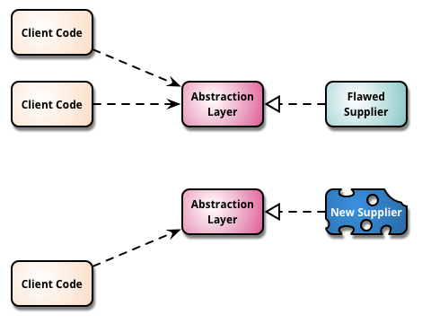
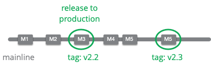
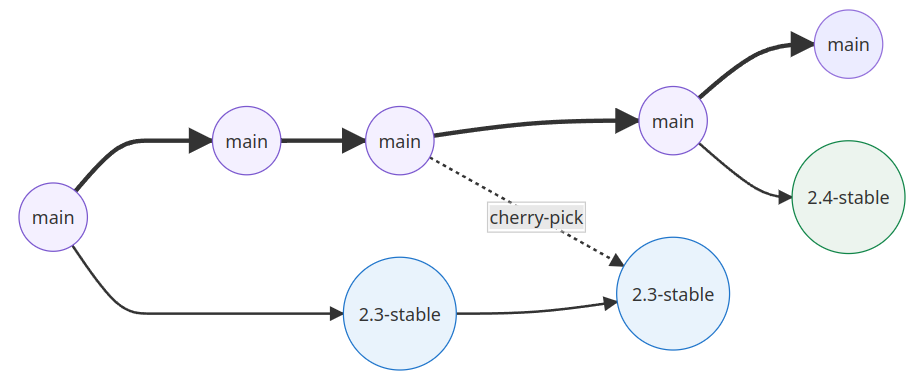
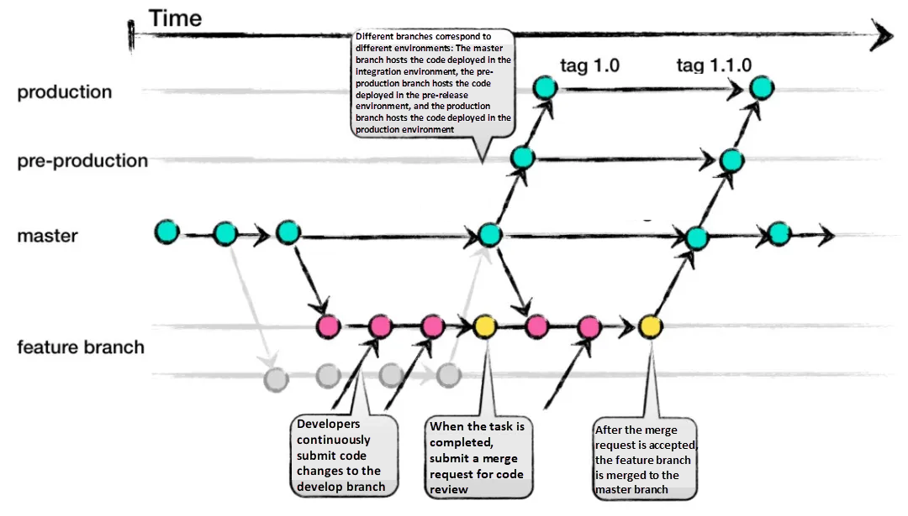

# Git Branch Modelleri

Merhaba Arkadaşlar,

Bu yazımızda Git ve benzeri Source Control Management (SCM) sistemlerinde kullanılan branch kavramı ve kullanım senaryolarını anlamaya çalışacağız.

Aşağıdaki konu başlıklarını inceleyeceğiz.

- Temel branch kavramları
- Branch entegrasyon modelleri
- Çok bilinen branch flow stratejileri
- Doğru model seçimi

Öncelikle şunu da eklemek istiyorum. İnceleyeceğimiz modellerden herhangi birinin savunucusu değilim. Ancak yaptığım işlerde best practice'lerin uygulanmasına önem gösteriyorum. Best practice'lerin altında ciddi bir tecrübe ve bilgi birikiminin olduğuna inanıyorum. Ancak zaten bu modellerden  herhangi biri best practice olsaydı zaten sadece onu konuşuyor/kullanıyor olurduk. Sık sık best practice kavramını kullanacağız makalede sık sık kullanacağız ancak burada bahsettiğimiz pratikler üzerinde konuştuğumuz flow'un kendi iç best practice'leri olacak.

Büyük ihtimal makaleyi okuyan herkesin konu ile ilgili bilgisi olacaktır. Bu nedenle bir uyarı yapmak istiyorum. Makale yavaş yavaş kurguyu geliştiriyor. Örneğin bir modeli incelerken eksikliklere çözüm bulmaya çalışmıyor daha çok onu anlamaya çalışıyor. Bu nedenle okurken ilk etapta bildiklerinizi unutarak ilgili modelin hangi probleme çözüm bulmaya çalıştığını anlamaya çalışın. Makalenin sonuna doğru bu parçalar birleşerek bir bütünü oluşturacak ve bu noktada çok bilinen bazı flow'ları inceliyor olacağız. Bu noktada flow'ların eksik tarafları ve neler yapılabileceğini de inceleyeceğiz.  

Makale temelde  [Martin Fowler](https://martinfowler.com/aboutMe.html)'in "[Patterns for Managing Source Code Branches](https://martinfowler.com/articles/branching-patterns.html)" başlıklı makalesine dayanıyor ancak yukarıda da bahsettiğim gibi amacımız sadece modelleri yalın olarak öğrenmek değil. Bu nedenle daha birçok farklı kaynaktan derlediğim ve sıklıkla deneyimlerimi de eklediğim uzun bir makale olacak. 

Umarın verimli bir okuma olur sizin için.

# Temel Branch Kavramları

## Source Branching (Kaynak Dallandırma)

Bildiğiniz üzere Git dağınık bir yapıya sahiptir. Bir repo farklı yazılımcılar tarafından klonlandığı an aynı reponun bir çok kopyası oluşmuş olur ancak son tahlilde bunlardan sadece biri kaynaktır (source). 

Scarlett ve Violet eninde sonunda kodlarını master repo üzerinde birleştireceklerdir.   Çoğunlukta bu tarz bir çalışmada istisnalar gözardı edilirse birleştirme (merge) esnasında çakışmalar (conflict) oluşacaktır. Genellikle bu çakışmaları da insan eli değmeden çözmek zordur.

Genellikle branch (dallanma) grafikleri herşeyin yolunda gideceği, kodların çok dağılmadan sık aralıklarla merge edileceği iyi niyeti ile çizilir. Ancak tabii ki gerçekte bu şekilde olmaz. Aşağıdaki şekilde bu durumu görebiliyoruz. Zaman geçtikçe klonlanan branch'lerdeki kodlarda uzun süre geliştirmeler yapılır ve süre uzadıkça master branch'den uzaklaşma artar. Bu nedenle merge süreçleri bazen biraz sancılı geçebilir.

Hiç branch olmadan yazılım geliştirmektense bu çeşit bir kurgu bile işimizi baya kolaylaştıracaktır.

Belki iki-üç kişilik bir takımda ve iletişimin yoğun ve kolay olduğu durumlarda bu belki yönetilebilir ancak takımlar büyüdükçe eğer scrum uygulanıyorsa ve bir feature'ın (özellik) tamamlanması günleri alıyorsa doğrudan bu yöntemle çalışmak zor olacaktır.

## Mainline (Ana Hat)

Üstte bahsettiğimiz Source Branch stratejisinden farklı olarak burada yazılımcılarda paylaşılmış master branch'den başka bir master branch olmaz. Kodun ana akışından (master branch) istediğimiz zaman kodu güncel halini alarak geliştirme yaptığımız branch'i güncel tutabiliriz.

Yeni sürüm çıkmak istediğimizde release branch'i oluşturup düzenlemeleri yaptıktan sonra sürüm de çıkabiliriz.

Burada mevzu entegrasyon değil buraya dikkat edelim. Amacımız temel branch stratejilerini anlamaya çalışıyoruz. Mainline stratejisinin alternatifi ileride göreceğimiz release train'dir.

## Healthy Branch (Sağlıklı Dal)

Burada amaç başta master branch olmak üzere tüm branch'lerin sağlık olarak tutulmasını sağlamaktır. Yani tek başına özel bir branch değil daha çok temel branch'lerin bozuk, çalışmayan, problemli kodları barındırmamasını sağlamaktır. 

Bunun için bir çok teknik var tabii ki, ilk aklımıza gelenler
- ilk aklımıza gelen TDD (Test Driven Development)
- kod bloğumuzu merge etmeden önce otomatik veya manuel yapılabilecek her türlü review diğer testler (UI test, fonksiyonel test, regression testleri vb.)

Bu üç branch türü haliyle tek başlarına çok kullanışlı görünmüyor olabilirler. Ancak uzun yıllar yazılım geliştiriciler bu ilkel yapıları kullandılar. 

Farklı ihtiyaçlar doğmaya ve takımlar da büyümeye başladıkça yazılım geliştirme metodolojileri de gelişmiş farklı yaklaşımlar ortaya çıkmıştır. Bu teknikleri ve stratejileri anlayabilmek içinde bu ilkel (primitive) teknikleri de anlamamız gerekiyor.

# Entegrasyon Modelleri

## Mainline Integration (Ana Hat Entegrasyonu)

Scarlett'in mainline (master) branch'i kendine kloanladığını ve bazı geliştirmeler yaptığını düşünelim. Ancak takım arkadaşı Violet de boş durmamış o da yapmış olduğu geliştirmeleri mainline'a  merge etmiştir (şekildeki mor renkli kutu).  Scarlet çalışmaya devam ederken istediği bir anda bu değişikliği alabilir. Şekilde kırmızı çizgi üzerindeki mor ve sarı renkli kutular da Scarlet'in bu değişikliği **fetch** yapıp ilgili (review ve test gibi) kontrollerden sonra kendi master branch'ine kodu aldığını göstermektedir.

Tabi burada eğer mainline'nın sağlıklı olduğunun garantisi varsa bu tarz bir işlemi yapmasına gerek kalmayacaktır.

Zaman geçtikçe Scarlett de yaptığı çalışmaları mainline'a merge edecektir. Mainline'daki gri çizgi üzerinde en sondaki kırmızı kutu da bu durumu göstemektedir. Bu merge işlemi sırasında eğer healthy branch standart olarak uygulanıyorsa merge işleminden önce review ve testler yapıldıktan sonra merge yapıalcaktır.

**fetch** işleminde kod doğrudan workspace'e alınmaz.

## Feature Branching (Özellik Dalı)

Bu modelde Scarlett kendi master branch'i üzerinden başka bir branch (feature branch) oluşturarak geliştirmelerini bu branch üzerinde devam ettirir. İsterse belirli aralıklarla mainline'da yapılan geliştirmeleri kendi master branch'ine alabilir. Belirli aralıklarla da üzerinde çalıştığı branch'e (feature branch) merge yapar. Feature branch geliştirmeleri bittiği anda çalışır kodlarını önce kendi master branch'ine oradan da shared master branch'e (mainline) mer yapar. 

Şekilde sarı kutucuklar Scarlett'in almış olduğu kodları kontrollü bir şekilde conflict (çakışma) problemlerini çözerek aldığını göstermektedir.

Bu yapı aslında sektörde sıklıkla kullanılıyor. Ancak burada kodların hangi sıklıklıkla mainline'a gönderileceği ve ne sıklıkla mainline'dan alınacağı çok önemli. Integration Frequency (entegrasyon sıklığı)
aynı zaman son zamandalar gittikçe popüler olan continuous integration modelini de etkilemektedir. Bu konulara da aşağıda değineceğiz. 

## Integration Frequency (Entegrasyon Sıklığı)

Her yıl bir çok büyük IT şirketinin hazırlamış olduğu "State of DevOps" raporları daha sık entegrasyon yapılan yazılım takımlarının ve geliştirdikleri ürünlerin daha kaliteli olduğunu göstermektedir. 

Google 2021 Raporunu [şu linkten](https://cloud.google.com/devops/state-of-devops/) indirebilirsiniz.

### Düşük Frekanslı Entegrasyon

Şekli incelediğimizde Scarlett ve Violet kendi repo'larında bir çok kez düzenleme yapmalarına rağmen mainline'a çok sık merge yapmadıklarını görebiliyoruz. Örneğin Scarlett S5 commit'ine kadar kendi düzenlemelerini mainline'a göndermemiş. Violet de V6'ya kadar yaptığı çalışmaları uzun süre mainline'a göndermemiş. 

Ayrıca S1-3'de Scarlett ve V1-3'te de Violet, mainline'dan almış oldukları kodlarda birbirlerine yapmış oldukları kodları vermemiş oldular. Yani uzun süre bu iki developer birbirlerinden habersiz kod yazmış oldular. Burada habersizlikten bahsettiğimiz durum aslında kodların birbirinden habersiz olmaları. Uzun süre kod paylaşımı yapılmadığı için yapılan merge işlemlerinde conflict'lerin oluşması da kaçınılmaz olacaktır.

### Yüksek Frekanslı Entegrasyon

Sık yapılan pull ve push işlemleri sayesinde iki developer yazdıkları kodları devamlı revize etme şansına sahip olacaklardır. Bu sayede sağlıklı branch'ler oluşturmak ve daha az conflict ile karşılaşmak mümkün olacaktır.

Uzun süre yapılmayan entegrasyonlar ileride geri dönüşü çok daha uzun sürebilecek problemlere yol açabilir.

Bu noktada birde "entegrasyon korkusu" kavramından bahsetmek gerekiyor. Takımlarda bir kaç kez kötü kod birleştirme deneyimi yaşandığında artık sık sık entegrasyondan yapmaktan çekindikleri görülür. Bu durumda daha sağlıksız ve problemli bir mainline oluşmasına sebep olur.

Aslında kaynak kod sistemleri bir iletişim aracıdır. Eğer sık sık kod paylaşımı yapılırsa bu da iletişimin artacağı ve hataların azalacağı anlamına gelir. 

Entegrasyon sıklığını arttırmanın en iyi yollarından biri de feature (özellik) boyutunu küçültmektir. Feature kavramı (her zaman yapılabilir olmasa da) user story hatta task seviyesine kadar indirilebilirse çok kısa sürelerle entegrasyon yapılabilir.

[Resim Kaynak](https://www.boost.co.nz/blog/2018/11/reduce-batch-size-agile-software-development)

Küçültme yaparken de etkili story yazma modellerinden biri olan "INVEST" modelinden faydalanabilirsiniz.

- Independent: Bağımzsız
- Negotiable: Tartşılabilir
- Valuable: Değerli
- Estimable: Tahminlenebilir
- Small: Küçük
- Testable: Test edilebilir.

Bu kavramların hepsini içeren optimum büyüklükteki bir story çok kısa sürede tamamlanabilir. Pratik ve akılda kalması kolay olduğu için bu model tercih edilebilir ancak tavsiyem daha geniş kapsamlı bir araştırma yapmanız, domaininize ve  çalışma şeklinizi en rahat adapte edebileceğiniz modeli bulmanız olacaktır. Ayrıca bu modelleri beraber kullanmak da mümkün. Örneğin hangi modeli tercih ederseniz edin TDD her durumda zaten yapmalısınız.

Özellikle FDD feature odaklılığı ile optimum feature boyutunu belirleme konusunda daha uzman bir model diyebiliriz. 

[Kaynak](https://www.inflectra.com/Ideas/Topic/Feature-Driven-Development.aspx)

- [Feature Driven Development (FDD)](https://en.wikipedia.org/wiki/Feature-driven_development) (Özellik Güdümlü Programlama)
  - Örnek Story: (action result object) --> Calculate the total of a sale, Validate the password of a user
- [Behaviour Driven Development (BDD)](https://en.wikipedia.org/wiki/Behavior-driven_development) (Davranış Güdümlü Programlama)
- [Test Driven Development (TDD)](https://en.wikipedia.org/wiki/Test-driven_development) (Test Güdümlü Programlama)

[Resim Kaynak](https://www.inflectra.com/Ideas/Topic/Feature-Driven-Development.aspx)

Model kullanmanın en büyük faydası story'lerinizi yazarken uymamız gereken kurallar ve teknikler sunuyor olması. Ne yapacağınızı bilmediğiniz durumlarda bu tarz modeller kesinlik yol gösterici olacaktır.

Ancak halen 2-3 saatlik alt task'lere bile bölsek bir feature'ı tamamen kullanılabilir şekilde yayına verebilmek için örneğin bir haftalık bir çalışmaya ihtiyaç duyabiliriz. Bu durumda kullanılabilecek bazı teknikler var.

- Keystone Interface
- Feature Flag
- Trunk Based Development
- Branch By Abstraction

Tabii ki bu tekniklerin her birini uzun uzun anlatmak gerekiyor.Başka yazılarımda belki bu başlıkları tek tek de inceleyebiliriz. Ancak birer paragraf yazıp ne olduğunu kavramsal olarak en azından anlamaya çalışalım.

#### Keystone Interface

Basitçe ilgili feature'un tetiklenmesini/kullanılmasını sağlayacak kodları en sona bırakıp tamamlanan bütün ara task'leri biter bitmez mainline'a entegre etmek şeklinde tanımlayabiliriz.

Örneğin feature'ın UI kısmını en sona bırakarak yazdığımız kodları kısa sürelerle mainline' da entegre edebiliriz.

[Resim Kaynak](https://martinfowler.com/bliki/KeystoneInterface.html)

#### Feature Flag

Belli  bir feature için geliştirdiğimiz kodların yayına alınmasını bir flag ile kontrol altında tutma üzerine kuruludur.

Bu işlemin yapılabilmesi için popüler programlama dillerinde çok yetenekli kütüphaneler bulunuyor.
- [Dotnet](https://docs.microsoft.com/en-us/azure/azure-app-configuration/use-feature-flags-dotnet-core?tabs=core5x), [kütüphaneler](https://featureflags.io/dotnet-feature-flags/)
- [Java](https://reflectoring.io/java-feature-flags/)
- [Python](https://www.split.io/blog/python-flask-feature-flags/#:~:text=Feature%20flags%20allow%20you%20to,without%20ever%20deploying%20new%20code.), [kütüphaneler](https://featureflags.io/java-feature-flags/)
- Go, [kütüphanaler](https://featureflags.io/go-feature-flags/)
- NodeJs, [kütüphaneler](https://featureflags.io/node-js-feature-flags/)
- Bütün dillerde ortak kullnabilceğiniz kütüphane : [Unleash](https://docs.getunleash.io/sdks)

[Resim Kaynak](https://dzone.com/articles/feature-flag-driven-development)

#### Trunk Based Development

Yazılımcıların trunk adı verilen mainline üzerinde kısa aralıklarla entegrasyon yaparak geliştirme yapmalarına dayalı bir model. Bu modelde temelde paralel release, hotfix, feature vb branch'ler reddedilir. Geliştiriciler yazdıkları kodları doğrudan trunk (master) brach üzerine merge ederler.

Peki release'lar nasıl çıkılacak? burada sistem 2 seçenek sunuyor

- 1. yöntemde release işlemleri doğrudan trunk branch üzerinde yapılır. Çok sık release çıkan takımlar için daha uygundur. Mantık şu o kadar çok release çıkılıyor ki trunk hiç durmadan devam edebiliyor. Günde birden daha fazla release çıkıyor olmak gerekiyor bu yöntem için. Eğer günde bir veya daha az release çıkılma durumu olursa o release'e özel 2. yöntem uygulanabilir.

Şekildeki yeşil noktalar commit'leri gösteyiyor. Kırmızı nokta ise bugfix gerektiren bir commit ve o da sonraki commit'lerde fix'lenmiş.

[Resim Kaynak](https://trunkbaseddevelopment.com/release-from-trunk/)
- 2. yöntemde ise release işlemlerini yönetmek için bir branch açılır ancak burada bugfix/hotfix yapılmaz. Fix işlemleri yine trunk branch üzerinde yapılır ve cherry-pick ile release üzerin alınır. Dikkat edilmesi gereken en önemli konu ise release asla trunk branch üzerine merge edilmez.  Release branch üzerinde işimiz bittiğinde branch'i silebiliriz.

[Resim Kaynak](https://trunkbaseddevelopment.com/branch-for-release/)

Trunk based development aynı zamanda Google'un da kullandığı bir modeldir. Resmi sayfasındaki dokümana [şu linkten](https://cloud.google.com/architecture/devops/devops-tech-trunk-based-development) ulaşabilirsiniz. Ayrıca Google'ın Trunk Based Development'ı nasıl kullandığını anlatan Youtube videosına [şu linkten](https://www.youtube.com/watch?v=W71BTkUbdqE&t=869s) ulaşabilirsiniz.

#### Branch by Abstraction

Aslında sistem çalışır haldeyken büyük ölçekli değişiklikler yapmak için kullanılan bir teknik. Araya soyut bir katman koyup değişiklikleri diğer bir soyut katmanda yapıp eklenen yeni özelliği kullanacak client sistemi yeni soyut katmana yönlendirmek şeklinde çalışır. Aslında iki katmanda sistemdedir ancak yeni yapılan ya erişilemez yada sistemin bir kısmının erişebileceği şekildedir.

1. Durum

2. Durum

[Resim Kaynak](https://martinfowler.com/bliki/BranchByAbstraction.html)

## Continuous Integration (Sürekli Entegrasyon)

Son zamanlarda sıklıkla adını duyduğumuz entegrasyon modelidir. Burada amaç tabiri caizse uygulama geliştirme sürecini bir nehir gibi devamlı akar hale getirmektir. Net bir rakam söylemek zor ancak genel kanı ve deneyimler bir yazılımcının gün de en az 2-3 kez entegrasyon yapması gerektiğini göstermektedir. Yukarıda sunduğumuz Google raporuna göre günce birkaç kez yapılan uygulama deployment modelinin en iyisi olduğu göstermektedir.

Diğer bir bakış açısı da bir güden fazla sürecek feature'ların beklenmesine gerek duyulmamalıdır. Hiç bir zaman kendi repo'muzda bir günden fazla entegre olmamış kod bulundurmamalıyız.

Burada ilk akla gelen soru olacaktır. Bu durumda bir günde bitmeyecek feature'lar için ne yapabiliriz? Yukarıda bahsettiğimiz
- Trunk Based Development
- Keystone Interface
- Feature Flag
- Branch By Abstraction
tekniklerini beraber kullanabilirsiniz.

### Feature Branch ve Continuous Integration Karşılaştırması

Continuous integration'ın başarılı olabilmesi feature'ların mümkün olduğunca küçük yapılabilmesine bağlıdır. Eğer bir takım tüm açtığı feature'ları aynı gün tamamlayabiliyorsa bu durumda hem feature branch hem de continuous integration yapabilir.  Ancak bunu çok az takımın başarabileceği de bir gerçek.

Google 2021 Raporunu [şu linkten](https://cloud.google.com/devops/state-of-devops/) indirebilirsiniz.

Continuous integration'ın faydalarını inceleyecek olursak
- iletişimi azaltır (çok sık yapılan entegrasyonlarda gereksiz toplantılara ortadan kalkar)
- entegrasyonlarda daha az iş çıkar
- hatalar daha hızlı fix'lenir
- entegrasyon korkusu azalır

Ancak bu hıza ulaşabilmek için çok iyi test sistemine sahip olmak gerekiyor.

Bu nedenle son 5 yıldır yazılım geliştirme tekniklerinde çok fazla yenilik duyduk. Cloud native uygulama geliştirme, container teknolojileri de bunların başında geliyor. Cloud native uygulama geliştirmeyi sağlayan en önemli tekniklerden başında da  mikroservis mimarisi geliyor. Feature'ları küçültmek kadar mimari yapıları küçültmek, daha az karmaşık yapılar kurmak da önemli, monolith yapılardaki mimarı kurgulara vakit harcamaktansa doğrudan domain isteklerine cevap vermek küçük kod blokları ile çalışmak takımlara hız kazandıracaktır.

- [The Twelve-Factor App](https://12factor.net/)
- [Microservice Architectures](https://microservices.io/)
- [Extreme-Programming](http://www.extremeprogramming.org/rules.html)

Bu faydalarına rağmen günde iki veya daha fazla entegrasyon bir çok takım için imkansız gibi görülebilir. Bunun sebeplerini şu şekilde sıralayabiliriz.

- Alışkanlıklar
- Bilinmezlikten korkmak
- Eskiden gelen kültür
- İş birimi etkileri
- Regülasyonlar
- Kod mimarisinin uygun olmayışı

Kod gözden geçirme (code review) süreçlerinin uzun sürüyor olması da continuous integration uygulamayı zorlaştıran bir unsur. Bu nedenle [Extreme-Programming](http://www.extremeprogramming.org/rules.html) metodunda taviz verilmeden uygulanan [Pair Programming](http://www.extremeprogramming.org/rules.html) tekniği ile kod geliştirmek review süresini indirebilir. Ayrıca statik kod analizi yapabilen [Sonarqube](https://www.sonarqube.org/) gibi araçlar da kullanılabilir.

Bununla birlikte açık kaynak uygulama geliştirirken feature branch ve pull request mekanizmasını kullanmak faydalı bir yaklaşım. Bu tarz community desteği ile geliştirilen uygulamaların her gün release çıkması zor görünüyor. Doğaları gereği sıkı kontrol altında olmaları gerekiyor ve genellikle feature'ların tamamlanması uzun sürüyor (yani her işin aynı gün bitmesi imkansız gibi). Bu nedenle continuous integration'a çok uygun değiller.

# Mainline'dan Release Çıkmaya Giden Yol

## Release Branch

Release branch oluşturulmasında amaç sürüm çıkarmaya engel olan tüm pürüzlerin kod geliştirme sürecini duraksatmadan giderilmesini sağlamaktır. Her sürüm için bir release branch oluşturulur ve yapılan değişiklikler düzenli olarak diğer release branch'lere ve mainline'a merge edilir. Bu yapının en büyük dezavantajı paralel olarak yönetilmeye çalışılan release branch'lerin bir zaman sonra bakımının zorlaşmasıdır.

Bu genellikle karşılaştığımız bir geliştirme modeli değil aslında. Sektörde genellikle kapalı kaynak geliştirilen uygulamalarda yayında tek bir versiyon olur. Bu nedenle buradaki release kavramı aynı anda birden fazla versiyonu yayından tutmak durumunda olduğumuz uygulamalardaki durumu ifade etmektedir. Açık kaynak kod projeler, kütüphaneler, component'ler, framework'ler..vb birden fazla release yayınlamak durmunda olbilirler.Ancak tabii ki bunun tek yolu bu değil yani birden fazla sürümü yayında tutmak için tek seçenek her versiyon niçin ayrı ayrı release branch açmak değil.

Release branch kullanmanın avantajları, 
- bu sistem öncelikle mainline'ı sağlıklı tutmak için idealdir. 
- Yapılan tüm hareketler (pull, push, commit, vb.) kolaylıkla takip edilebilir. 
- Her bir release'in ayrı bir branch olarak tutuluyor olması aynı anda hepsini erişilebilir tutmaktadır. 

## Maturity Branch

Yayına çıkmış bütün versiyonların tutulduğu branch'dir. İki temel faydası bulunmaktadır.
- Production ortamında halen çalışan lastest version'a ulaşmak ve böylece bug çıktığında sürüm geçmişini takip etmek kolaylaşır.
- Otomasyon için uygun ortam hazırlar. Sadece maturity branch üzerindeki versiyonlar üzerinden her zaman çalışan bir sürüme geçişi mümkün kılar.

Şekilde de görüleceği üzere production branch burada maturity branch olarak kullanılmaktadır 

Diğer bir kullanımda da maturity branch üzerinde örneğin test için hazır olan versiyona test-01, prod için hazır hale gelen versiyona da prod-01 şeklinde tag'leme yapabiliriz. Böylece kodumuzun gelişimini takip etmek ve otomasyon iş akışlarını daha anlaşılır tasarlamak mümkün olacaktır.

Maturity branch kullanımının diğer bir versiyonu da aşağıdaki şekilde görüldüğü gibidir. Mainline ile paralel giden bir release branch'i üzerinde sürüm için gerekli düzenlemeler yapılarak tag'lenir. Release üzerinde yapılan fix ve diğer düzenlemeler daha sonra mainline'e merge edilir. Böylece takım üyeleri bu düzenlemeleri de almış olur.

## Environment Branch

[Resim Kaynak](https://octopus.com/docs/deployments/patterns/branching)

Her bir ortam için ortama özel düzenlemeler yapmak için kullanılır. En sonunda maturity branch (üstteki şekil için production branch) üzerinde birleştirilir. 

[Resim Kaynak](https://martinfowler.com/articles/branching-patterns.html#Low-frequencyIntegration)

Başta kullanışlı gibi görünen bu modelin en büyük problemi herhangi bir ortam için bulunan çözümün diğer ortamlarda beklenen sonucu vermemesidir. Bu yöntemi daha efektif kullanabilmek için çevresel değişkenleri (environment variables) koddan soyutlanmalıdır. Bu sayede çevresel değişkenler runtime'da dinamik olarak atanabilirler. İlk akla gelen iki yöntem;

- Açık dosyalarda tutulabilir. (IIS için örneğin web.config, Java EE/TomCat için web.xml gibi)
- Host üzerinde environment variable üzerinde tutulabilir.

Bu branch yapısını hata ayıklamak veya ortamlara göre çevre değişkenlerini yönetmek için kullanılmamalıdır. 

## Hotfix Branch

Aniden gelen hataların düzeltilmesi için kullanılır. Continuous integration  yapılan durumlarda doğrudan mainline üzerinde de bu düzeltmeler yapılabilir. 

[Resim Kaynak](https://martinfowler.com/articles/branching-patterns.html#Low-frequencyIntegration)

Yada örneğin bir release branch kullanılıyorsa onun üzerinde de bu tarz düzeltmeler yapılabilir. Ancak her iki durumda da eğer düzeltme yapılırken geçen süre takımın commit rutinlerini bozuyorsa mecburen hotfix branch açılmalıdır.

[Resim Kaynak](https://martinfowler.com/articles/branching-patterns.html#Low-frequencyIntegration)

Burada belki en önemli konu neyin hotfix olup olmadığına karar verilmesidir. Hotfix kavramının için doldurmak, tanımını takım içinde net olarak ortaya koymak gerekiyor.

[Hotfix](https://en.wikipedia.org/wiki/Hotfix), [SDLC](https://en.wikipedia.org/wiki/Systems_development_life_cycle) development ve test süreçleri dışında uygulama üzerinde doğrudan ve hızlı değişiklik yapmak demektir. Bu değişiklik sistemi downtime'a uğratmayacak boyutta olmalıdır. Yani sistemde yapılacak bu değişikliği kullanıcılar hissetmemelidir. Bunların dışında uygulamada karşılaşılan hatanın

- kritiklik seviyesi,
- düzeltilmesi için harcanacak zaman,
- hatanın düzeltimesi için etkilediği veya bağımlı olduğu kod bloklarına olan etkisi,
- maliyeti (adam/gün)
- vb.

durumlarına bakılarak da hotfix/bugfix olup olmadığına karar verilebilir.

[Resim Kaynak](https://www.bmc.com/blogs/patch-hotfix-coldfix-bugfix/)

## Release Ready Mainline (Yayına Hazır Anahat)

Yayına çıkılabilir commit'ler oluşturarak mainline healthy branch olarak kullanılır. Bu modelde her commit continuos deployment'daki gibi release olabilir durumda değildir.  Continuos delivery ile continuous deployment arasındaki ince fark da budur zaten.

[Resim Kaynak](https://www.bmc.com/blogs/continuous-delivery-continuous-deployment-continuous-integration-whats-difference/)

Bu entegrasyon modeli bu haliyle çok iyi görünüyor elbette ancak başarılı olabilmesi için bir fikrin oluşmasından prod'a girmesine kadar geçen sürenin çok kısa olması gerekiyor. Takımın öncelikle daha önce bahsettiğimiz continuous integration modelindeki commit sıklığına erişebiliyor olması lazım.

Eğer isterlerin hayata geçmesi uzun sürüyorsa projemizde feature branch kullanmak zorunda olabiliriz. Bu durumda release ready mainline entegrasyon modelini zorlamak daha büyük problemlere yol açabilir. Büyük ihtimalle çözümü uzun zaman alacak conflict'lerle uğraşmak zorunda kalacağız. Bu durumdan kurtulmak için release branch kullanabiliriz. Böylece mainline'in akışını engellememiş oluruz.

[Resim Kaynak](https://martinfowler.com/articles/branching-patterns.html#Low-frequencyIntegration)

Release ready mainline'nın belki en büyük faydası/avantajı yazılım takımlarını disipline etmesidir. Yayına hazır bir mainline'ı hayatta tutmaya çalışmak için takımlar

- best practice'leri ve
- iyi bir test rejimi uygulamak,
- entegrasyonlarda dikkati üst seviyede tutmak durumundadırlar.

## Release Train

Release çıkma tarihlerinin düzenli olduğu durumlarda kullanılır. Takımların üzerinde çalıştıkları feature'a odaklanmalarını sağlar. Ayrıca continuous integration modeline  geçiş için kullanılabilecek bir modeldir. Takım deneyim kazandıkça release aralıkları kısaltılır.

[Resim Kaynak](https://martinfowler.com/articles/branching-patterns.html#Low-frequencyIntegration)

Belirli tarihlerde release çıkıldığı için takım release'a kısa bir süre kala geliştirmeyi yavaşlatabilir veya tamamen durdurabilir. Release zamanına kadar yapılması gereken hotfix, test, ortam düzenlemeleri vb. işleri tamamlarlar.Bir sonraki release (nisan ayı) branch'i için aktif (mart ayı) branch'inin kopyası alınır ve nisan ayı release'i için kodlamaya başlanır. Bu andan itibaren mart ayı branch'inde yapılan değişiklikler nisan ayı branch'ine aktarılır.

Eğer projemizde release ready mainline kullanıyorsak aynı anda  bir çok branch yönetmek zorunda değiliz yani release train kullanmadan da release'leri yönetmek mümkün olabilir.  

[Resim Kaynak](https://martinfowler.com/articles/branching-patterns.html#Low-frequencyIntegration)

# Diğer Branch Modelleri

- **Experimental (Deneysel) Branch**

  Bir fikri denemek için oluşturulan branch'tir. Ufak testleri yapmak daha mantıklıdır. Kodu büyük ihtimalle entegre etmek gerekmeyecektir ancak hakikaten çok uğraşıldıysa ve kod temiz yazıldıysa entegre edilebilir.

- **Future Branch**

  Continuous integration modeli ile çalışılırken bazen aynı gün entegrasyon yapılamayacak yada yapılsa bile etkileri fazla olabilecek değişiklikler için açılır. Feature branch'den farklı olarak healthy mainline üzerinde continuous integration yapılan projelerde yani feature branch kullanılmayan ortamlarda kullanılır. Ayrıca bir projede future branch sadece bir tane olur ve birden fazla developer üzerinde çalışabilir.

- **Collaboration (İş Birliği) Branch**
  Bazen kod yazılırken mainline'a entegre etmeden diğer yazılımcılarla kodu paylaşmak gerekir.  Geçici süreli bir branch açılarak onun üzerinden paylaşım yapılır.

- **Team Integration Branch**
  
  Collaboration Branch'in daha katı ve süresiz olarak uygulandığı biçimidir. Amaç çok kalabalık veya birden fazla takımın aynı mainline üzerinde çalışması gerektiği durumlarda mainline'a giden yolda ara healthy sub branch'ler oluşturarak daha kontrollü geçiş sağlamaktır. 

## Git Branch Akışları

### Git-Flow
En çok bilinen git flow policy'lerinden biri herhalde Gir-Flow'dur. [Vincent Driessen'in](https://nvie.com/posts/a-successful-git-branching-model/) 2010 yılında detaylıca anlattığı bir workflow'dur.

Mainline olarak develop branch'i kullanılır. Biden fazla developer'ın koordineli çalışabilmesi için feature branching kullanılır. Geliştiricilerin aynı iş üzerinde çalışmalarını sağlamak amacıyla kendi lokal repolarını collaboration branch olarak kullanmaları tavsiye edilir.

Maturity branch olarak master branch kullanılır. Geliştiriciler develop branch'inden master'a geçiş yapmak için release, hotfix'ler için hotfix branch'lerini kullanırlar. 

Git-flow healthy branch ve release ready mainline kavramlarını hiç kullanmaz. Bu kavramlarla alakalı bize bir çözüm sunmadığı için community kendi çözümünü buluyor gibi görünüyor. QA hakkında da bir çözümü yoktur. Ayrıca feature'ların tamamlanma süresi ve entegrasyon sıklığı hakkında da bir şey sunmaz.

[Vincent](https://nvie.com/posts/a-successful-git-branching-model/) bizzat kendisi artık git-flow'un geçen 12 yılda biraz eskidiğini, yazılımcıların daha sade ve continuous integration'a daha yatkın  flow'ları kullanmalarını tavsiye etmiştir. Ancak halen özellikle kapalı kod uygulama geliştiriliyorsa ve kararlı bir versiyonlama varsa, eksik kısımlar için çalışma şeklinize göre çözümler üreterek git-flow'un kullanılabileceğini de eklemiş. 

Şekli inceleyecek olursak bazı dezavatajlarını şöyle sıralayabiliriz.
- Hotfix ve release branch'lerinin hem develop hem de master branch'e merge edildiğini görebiliriz. Bu da karmaşıklığı arttırıyor.
- Release durumu iki build ile sonlanıyor. Biri release branch'inin son commit'inde diğeri ise master branch'e merge edildiğinde. 
- Ayrıca geliştiricilerin mainline olarak develop branch'ini kullanıyor olması yanlışlıkla master branch'a commit yapmaya sebep olabileceğini görebiliriz. Çünkü SCM sistemlerinde genellikle master branch default mainline branch olarak geliyor.

Bir feature'a yayına vermek için basitçe şu adımlar uygulanır.

- ilk etapta ana branch'leri oluşturmak gerekiyor bunun için master branch'den develop branch'i oluşturulur.
- feature branch'i de develop'dan oluşturulur.
- feature tamamlandığında develop branch'ine merge edilir.
- release zamanı geldiğinde develop branch'inden bir (isimlendirme release-* olacak şekilde) release branch oluşturulur ve maturity (master branch)'e merge yapılana kadar geçen sürede gelecek ufak bugfix'ler bu release branch' uygulanır.
- Release artık production için hazırsa master'a release tag ile birlikte (genelllikle pull request ile)  merge edilir. Aynı merge işlemi (genellikle doğrudan) develop branch'ine de yapılır.
- Eğer merge edilen release canlı tutulmayacaksa, yani bu release'e özel ileride geliştirme yada bugfix dışında ciddi işler yapılmayacaksa silinebilir. Eğer bu tarz işler yapılacaksa release silinmez.
- Hotfix gerektiğinde master branch üzerinden (hotfix-* isimlendirme ile) bir branch oluşturulur. Düzenlemeler yapıldıktan sonra master branch'e ve eğer release branch'iniz ayaktaysa ona değilse develop branch'ine merge yapılır. Ancak eğer release branch'e merge edildiyse release üzerinden develop branch'ine de  merge edilir.

Dikkat edilecek konular
- Master'a merge edilirken kesinlikle test ve code  review'ler yapılmış olmalı.
- Eğer ilgili release'ın yayına çıkıp çıkmayacağı konusunda şüpheler varsa bu durumlar için feature flag kullanmak gerekebilir.
- Mümkün oldukça bir release' de bir feature çıkartmaya çalışın.

### GitHub Flow

Git-flow'a bir tepki olarak doğmuştur. GitHub-flow için en basit ve anlaşılır anlatım Scott Chacon'a aittir. Makalesine [şu linkten](http://scottchacon.com/2011/08/31/github-flow.html) ulaşabilirsiniz.

[Resim Kaynak](https://www.alibabacloud.com/blog/how-to-select-a-git-branch-mode_597255)

Şu adımlar uygulanır

- Master branch üzerindeki her şey deploy edilebilir.
- Yeni bir feature/bugfix/hotfix üzerinde çalışmak için, açıklayıcı olarak adlandırılmış bir branch oluşturulur.
- Çalışmalar local branch üzerine yapılır ve belirli aralıklarla sunucuda aynı adlı branch'e push yapılır.
- Geri bildirime veya yardıma ihtiyacınız olduğunda veya branch'in birleşmeye hazır olduğunu düşünülüyorsa, pull request oluşturulur. 
- Bir başkası ilgili kodu gözden geçirdikten sonra kod merge edilebilir.
- Kod master'a merge edildiğinde artık deploy için hazır demektir. İlgili commit veryon numarıa ile tag'lenerek yayına verilir.
  
Git-flow'dan farklı olarak GitHub-Flow release-ready-mainline üzerine yüksek frekanslı entegrasyon ile tek bir sürümü yönetir. Yani GitHub-Flow için release branch'e gerek yoktur. Geliştiriciler feature branching kullanarak geliştirmelerini yaparlar. Feature'ın büyüklüğü ve zamanı hakkında GitHub-Flow bir şey söylemez. Kod kalitesi için entegrasyon öncesi review kullanılır. Git-Flow'daki develop branch burada yoktur bu da yapılabilecek hataların önüne geçer ve ve flow bu sayede daha sadedir.

Master branch'i her an yayına çıkacak kadar sağlıklı tutmak zor. Sadece bunun için review ve merge işlemleri için bile bir personel gerebilir. Daha entegrasyon frekansı için aslında doğrudan birşey söylemez. Bunun hızı yönetmek tamamen takıma kalmıştır. Birden fazla release yönetmek konusunda da birşey demez ancak yine burada da community kendi çözümünü bulmuş gibi görünüyor. Bazı açı kaynak kod projelerinde paralel yönetilen release branch'lerini görebilirsiniz. Bütün branch'ler  (feature/bugfix/hotfix) main üzerinde açıldıktan sonra geliştirme bittiğinde ilgili release'e merge edilerek release yapılır. Ancak bu yöntem resmi olarak belirtilmemiştir.

### Gitlab Flow
[GitLab-Flow](https://docs.gitlab.com/ee/topics/gitlab_flow.html)'da GitHub-Flow gibi Git-Flow'un problemleri üzerinden kendini konumlandırır. Ancak GitHub-Flow dağıtımlar, ortamlar, sürümler ve sorunlu entegrasyonlarla ilgili birçok soruyu yanıtsız bıraktığı için bu alanlara da çözüm bulduğunu iddia ederek ortaya çıkmış bir flow'dur. GitHub-Flow ile Git-Flow'un karışımı gibi bir yapısı vardır.

- Burada da mainline Git-Flow ve GitHub-Flow'da olduğu gibi her an yayına çıkılabilir durumda değildir. Bunun yerine duruma göre environment veya release branch kullanılır.
- Git-Flow ve GitHub-Flow'dan farklı olarak environment branch kullanımını desteklenir.
- Release Branch ve Environment branch bu flow'da tercih olarak vardır.
- Dev branch yoktur doğrudan mainline (main branch) üzerine feature branch'ler merge edilerek çalışılır.
- Environment based flow kullanılıyorsa Production branch üzerinden deployment tag'lenerek yapılır. Eğer release based flow kullanılıyorsa  ilgili versiyona özel release branch açılır.

GitLab iki durum için farklı flow'lar sunmaktadır. Biz de aynı şekilde devam edeceğiz.

#### Release Based Gitlab Flow

Dış dünyaya uyguluma geliştiriliyorsa büyük ihtimal uygulamanın aynı anda birden fazla versiyonunu yayında tutmak gerekecektir bu durumda versiyon tabanlı flow kullanılır, aşağıdaki adımlar uygulanır.

- Mainline (master) branch üzerinden feature branch açılır.
- Feature branch üzerinde geliştirmeler bittiğinde pull/merge request ile master branch'e merge yapılır. Bu arada code review ve mümkünse testler de yapılır. Burada yapılacak tesler mümkün olduğunca otomasyona dahil edilmelidir.
- release zamanı geldiğinde master branch üzerinden release branch (release-* isimlendirme ile) açılır. release özel yapılcak işlemler yapılır. Burada kesinlikle release üzerinde hotfix, bugfix veya ek geliştirme yapılmaz. Uygulama bu noktadan yayıan verilir. yayından kastımız bir yere deployment'da olabilir yada release'ı çıkıp dış dünyaya duyurmak olabilir.
- Bugfix/Hotfix'ler için doğrudan master branch kullanılır ([upstream-first policy](https://www.redhat.com/en/blog/what-open-source-upstream)). Bir branch açılır işlemler bitince merge/pull request ile master branch'e merge yapılır. Daha sonra bugfix/hotfix **ilgili release** branch'e [cherry-pick](https://git-scm.com/docs/git-cherry-pick) ile çekilir. Upstream'den downstream'e doğru hareket yapıldığı için Git-Flow'da olduğu gibi dağıtmaya gerek kalmıyor.

Release branch üzerine release-test-* veya release-rc-* vb tag'lar atılarak tam olarak release olmadığı belirtilebilir.

#### Environment Based Gitlab Flow

Dışa kapalı ve aynı anda production ortamında tek bir versiyon yayında olacaksa environment tabanlı flow kullanılır, aşağıdaki adımlar uygulanır.

[Resim Kaynak](https://www.alibabacloud.com/blog/how-to-select-a-git-branch-mode_597255)

- Mainline (master) branch üzerinden feature branch açılır.
- Feature branch üzerinde geliştirmeler bittiğinde pull/merge request ile master branch'e merge yapılır. Bu arada code review ve mümkünse testler de yapılır. Burada yapılacak tesler mümkün olduğunca otomasyona dahil edilmelidir.
- release zamanı geldiğinde master branch pre-production branch'ine merge edilir. Bu arada pre-production branch'i arttrılabilir ancak tavsiye edilmiyor.
- Bugfix/Hotfix'ler için doğrudan master branch kullanılır ([upstream-first policy](https://www.redhat.com/en/blog/what-open-source-upstream)). Bir branch açılır işlemler bitince merge/pull request ile master branch'e merge yapılır. Daha sonra bugfix/hotfix öncelikle pre-release ve sonrasında release branch'lerine [cherry-pick](https://git-scm.com/docs/git-cherry-pick) ile çekilir. Upstream'den downstream'e doğru hareket yapıldığı için Git-Flow'da olduğu gibi dağıtmaya gerek kalmıyor.

#### GitLab Flow Best Practice'leri

GitLab bazı best practice'ler sunnmuş sayfasında tabiiki bunların hepsini uygulamak zor ancak en azından fikir vermesi adına buraya ekliyorum.

- Main Branch'e doğrudan commit yapılmamalı feature branch kullanılmalı.
- Sadece main branch'e yapılan commit'ler değil tüm commit'ler test edilmeli.
- Bütün testler bütün commit'lerde çalıştırılmalı.
- Merge etmeden önce review yapılmalı.
- Tag'ler geliştiriciler tarafından set edilmelidir CI tarafından değil (CI 'ın repo'yu değiştirmesine izin verilmemeli)
- Release yönetimi tag kullanılarak yapılmalıdır.
- Push edilmiş commit'ler rebase yapılmamalıdır. Bu özellikle cherry pick yapılacağı zaman gelişimi ve test sonuçlarını tanımlamayı zorlaştırır.
- Bugfix'ler öncelikle main üzerinde yapılmalıdır daha sonra release branch'ler de yapılmalıdır.
- Commit mesajları sadene ne yapıldığını değil neden yapıldığını da anlatmalıdır.
- Geliştiriciler main branch ile başlayıp sonuçta da main branch'i hedeflemelidir.
# Kapanış ve Tavsiyeler

Buraya kadar bütün makaleyi okuduysanız bir çok kavram kafanızda oyurmuştur. Ancak halen ben de olduğu gibi sizin de aklınız da bir çok soru olabilir. 

- Hali hazırda uyguladığımız custom flow'umuzu değiştirmeli miyiz?
- Değiştireceksek bunu nasıl yapabiliriz?
- Yeni bir peojeye başlarken flow'lardan birini seçmeli miyiz yoksa kendimiz bir flow oluturabilir miyiz, daha doğrusu mantıklı bir karar olur mu?
- Bahsi geçen flow'ları değiştirerek kullanmak mümkün müdür, mantıklı mıdır?
- Entegrasyon frekansı için bir best practice var mıdır?
- Özellikle continious integration noktasına gelmek her proje için mantıklı mıdır? 

ve daha bir çok soru aklımızda olabilir. Burada çok kesin net cevaplar vermek yani bir best practice sunmak imkansız. Makalenin en başında da dediğim gibi burada bahsi geçen protiklerden hiç biri best practice değil. Ankca herhangi birine yöneldikten sonra kendi içlerinde best practice'leri olabilir. Bunlar bile yine yine sizin proje yapınız, çalıştığınız ortamın iç dinamikleri ve kültürüne göre şekklenebilcek yaklaşımlar.

Git-Flow ilk kez biz makale ile duyuran ve yıllar sonra yine kendi tarafında aynı makalye ek yapıp artık farklı flow'ların değişen şartlardan dolayı kullanılması gerektiğini söyleyen  [Vincent Driessen](https://nvie.com/posts/a-successful-git-branching-model/), yine aynı makalede Git-Flow'un halen belirli şartlarda kullanılabilceğini ancak her derde deva olacak bir çözümün halen olmadığını belirtmiş. Aynen şu cümleyi kullanarak makalesini sonlandırıyor.

"To conclude, always remember that panaceas don't exist. Consider your own context. Don't be hating. Decide for yourself." Yani "Sonuç olarak, her derde deva olmadığını her zaman hatırlayın. Kendi bağlamınızı düşünün. nefret etme. Kendin için karar ver." Yani ihtiyacına göre evrilt ve kullan.

Ancak yine de yukarıdaki sorulara madde madde cevap aramaya çalışalım. Zannediyorum bu temel sorulara sizde çalıştırğınız ortamlarda biraz kafa yorarsanız en doğru flow'u oluşturabilirsiniz.

- Hali hazırda uyguladığımız custom flow'umuzu değiştirmeli miyiz?
  
Eğer yolun başındaysanız ve kendinize daha uygu olduğunu düşündüğünüz bir flow üzerinde takım olarka hemfikirseniz değiştirmak mantıklı olabilir. Çalıştığınız projenin bitiş süresi yoksa yani devamlı olarak geliştirilen bir proje ise yine değiştirmek mantıklı görünüyor. Ancak proje süresi belirli ise ve projede çok ilerlediyseniz flow değiştimek bitiş tarihini geciktirecekse yeni flow'a geçiş çok mantıklı görünmüyor. 

- Değiştireceksek bunu nasıl yapabiliriz?

Takımın üzerinde anlaştığı master branch üzerinde bir commit baz alınarak bu noktadan itibaren yeni flow uygulanmaya başlayabilir.

- Yeni bir peojeye başlarken flow'lardan birini seçmeli miyiz yoksa kendimiz bir flow oluturabilir miyiz, daha doğrusu mantıklı bir karar olur mu?

Belki alınamsı gerekn en önemli karar bu herhalde. Aslında bunun gibi karar verme durumlarını geliştiriciler proje geliştirme sürecinde bir çok kez yaşıyor. Kendimiz dışında başka birilerinin verdiği karar, yazdığı kod, söylediği best practice ... vb. acaba bize de uyar mı? tabi bu her durum ve söyleyene göre değişecektır. Ancak en azından şunu söyleyebiliriz, eğer kendimizi değiştirerek bir flow'u kullanabileceksek bunu kesinlikle yapmalıyız. Büyük ihtimalle zaten böyle bir arayışa gittiysek birşeylerin yanlış gittiğini kaül etmişiz demektir. Bu da kendimizi değiştirmekten geçiyor. 

- Bahsi geçen flow'ları değiştirerek kullanmak mümkün müdür, mantıklı mıdır?

Eğer kabül ettğimiz pratik kendi içinde katı kurallarla geliyorsa yani bu pratiği şu şekşilde kullanmazsan çalışmaz yolda kalırsın diyosa o protiği alıken bu best practice'leriyle birlikte almak mantıklı olacaktır yani değiştirmeye çalışmak mantıklı görünmüyor. Ancak buraya kadar kendi içinde bu kadar katı kuralları belki continious integration söyleyen yok gibi görünüyor. (entegrasyon frekansı yüksek olmalı). Bu durumda değişime açok yerlerini biraz kendimize uygurmak mantıklı olabilir. Ancak örneğin Git-Flow'daki develop branch'ini kullanmayalım doğrudan master branch'e kod yazalım demek zaten bir değişiklik değil tamamen Git-Flow dışında custom bir flow oluşturmak demektir. Ama mesela GitLab-Flow üzerinde environment based flow uygularken pre-production katmanını arttırmak sisteme zarar vermeyecektir. 

- Entegrasyon frekansı için bir best practice var mıdır?

Deneyimlere göre en az iki olmalı diyebiliriz. Üst limit diyen yok anacak tabi oradada kendimize göre bir optimum limit belirlyebiliriz.

- Continious integration uygulamak bir best practice'midir? her projenin bu noktaya gelemeyi hedeflemesi, o kaktaya gelemeye çalışması mantıklı mıdır? 

Çok kısa bir cevap olacak ancak daha makalenin ilgili konu başlığında değindiğimiz için doğrudan mantıklı değildir diye cevap verebiliriz. 
- Çünkü öncelikle proje yapısı (microservice, monolith, modular, modular-monolith,...vb) bunu desteklemeli. 
- Altyapıdan sonra en öncemli etken takımın yeterliliği en önemli farktörlerden birisi. 
- Son olarak çalıştığınız domain ve iş biriminin buna uygun olup olmadığı. 

Bu üçünden biri eğer bu hıza ayak uyduramayacak durumdaysa continuos integration pratiklerini uygulamaya çalışmak zorlu olabilir. Bununla beraber hedef olarak adım adım buraya evrilmek çok mantıklı bir karar olacaktır. Buna başlamak için en uygun yer de zannediyorum proje altyapısı olacaktır. Zaten bununşa birlikte takım yeteneklerini geliştirecektir. Son olarak iş biriminin iş isteme ve test sonuçları için dönüş hızlarını arttırmak mantıklı olacaktır. Deneyimlerime dayanarak bu süreçlerden en zorlusu iş birimi kültürünü değiştirmek olacaktır diyebilirim. Bu nedenle öncelikle iş birimine iş(task) kavramını nasıl küçültecekleri, nasıl takip edecekleri ve bu geçişin  herkes için ne kadar faydalı olacağı anlatılmalı.  

Buna rağmen bazen iş birimi baskısı, bazen yazılım takımlarındaki heterojen yapı, bazen eskiden beri kullanılan yapının inatla korunmaya çalışılması gibi nedenlerle best practice'lerin uygulanması imkansız olduğu durumların da farkındayım.

Ancak şunu da söyleyebilirim yazılım takımları problemlere çare bulma konusunda uzman olduklarından bulundukları durumun daha iyi olması için şartları zorlamaktansa bazen durumu kabül edip hatta duruma ayak uydurup birde üstüne bu bozuk durumun daha iyi çalışması için çözüm (!) üretmeyi tercih edebiliyorlar. Kendimi de dahil ederek  söylüyorum yanlış kültürü değiştirmek için savaş vermektense bozuk durumu en iyi nasıl yönetirim sorusuna cevap bulmak çoğu kez daha kolay geliyor. Onla uğraşıp dert anlatmakla vakit kaybedeceğime hemen yapar geçerim diyoruz çoğu kez.

Makalemiz burada sona erdi. Umarım faydalı olmuştur.

# Kaynaklar
- https://martinfowler.com/articles/branching-patterns.html
- https://martinfowler.com/articles/continuousIntegration.html
- https://martinfowler.com/bliki/KeystoneInterface.html
- https://www.gitkraken.com/learn/git/best-practices/git-branch-strategy
- https://www.atlassian.com/git/tutorials/comparing-workflows
- https://gitential.com/git-branching-strategies-for-your-team-how-to-choose-the-best/
- https://launchdarkly.com/blog/git-branching-strategies-vs-trunk-based-development/
- https://towardsdatascience.com/how-to-structure-your-git-branching-strategy-by-a-data-engineer-45ff96857bb
- https://softwareengineering.stackexchange.com/questions/107884/to-branch-or-not-to-branch
- https://dev.to/jpdelimat/why-you-should-not-use-feature-branches-h68
- https://trunkbaseddevelopment.com/
- https://trunkbaseddevelopment.com/branch-for-release/
- https://cloud.google.com/architecture/devops/devops-tech-trunk-based-development
- https://www.boost.co.nz/blog/2018/11/reduce-batch-size-agile-software-development
- https://en.wikipedia.org/wiki/Behavior-driven_development
- https://en.wikipedia.org/wiki/Feature-driven_development
- https://en.wikipedia.org/wiki/Test-driven_development
- https://www.inflectra.com/Ideas/Topic/Feature-Driven-Development.aspx
- https://featureflags.io/
- https://docs.getunleash.io/sdks
- https://medium.com/geekculture/enhanced-working-flow-from-git-flow-github-flow-and-gitlab-flow-9fdb02ef65dd
- https://www.toptal.com/gitflow/enhanced-git-flow-explained
- https://www.alibabacloud.com/blog/how-to-select-a-git-branch-mode_597255
- https://docs.gitlab.com/ee/topics/gitlab_flow.html
- https://about.gitlab.com/topics/version-control/what-are-gitlab-flow-best-practices/
- https://jadsonjs.wordpress.com/2021/05/16/gitlab-flow/
- https://learn.gitlab.com/version-control/15-git-tips-to-impro
- https://nira.com/gitlab-workflow/
- https://docs.microsoft.com/en-us/azure/devops/repos/tfvc/effective-tfvc-branching-strategies-for-devops?view=azure-devops
- https://docs.microsoft.com/en-us/azure/devops/repos/tfvc/effective-feature-isolation-on-tfvc?view=azure-devops
- https://docs.microsoft.com/en-us/azure/devops/boards/backlogs/define-features-epics?view=azure-devops&tabs=agile-process
- https://www.alibabacloud.com/blog/how-to-select-a-git-branch-mode_597255
